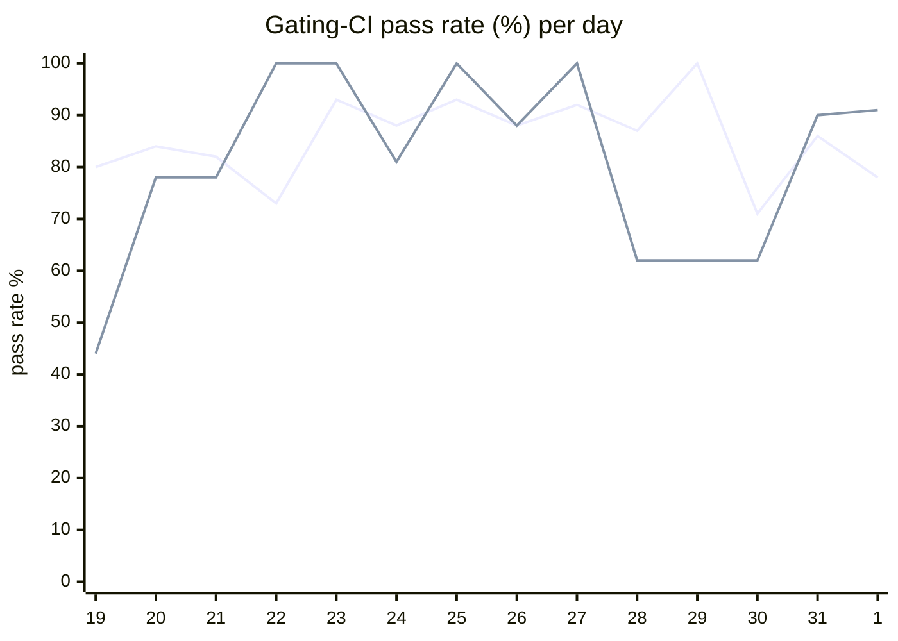

# CI Health Dashboard

_Window: last 14 days (trend + pass rate) · tables: last 24h · updated 2026-09-02T07:08:03Z · auto-generated, do not edit by hand._

**Gating-CI pass rate** — PR: 84% (2288/2718) · main: 79% (120/152)

## Gating-CI pass-rate trend

```mermaid
xychart-beta
  title "Gating-CI pass rate (%) per day"
  x-axis [19, 20, 21, 22, 23, 24, 25, 26, 27, 28, 29, 30, 31, 1]
  y-axis "pass rate %" 0 --> 100
  line "CI" [80, 84, 82, 73, 93, 88, 93, 88, 92, 87, 100, 71, 86, 78]
  line "main" [44, 78, 78, 100, 100, 81, 100, 88, 100, 62, 62, 62, 90, 91]
```

_X-axis = day of month (Aug 19 → Sep 01). Two lines: **CI** (PR gating-CI runs, generally the upper line) and **main** (post-merge main runs, lower). Y-axis = % of that day's gating-CI runs that passed._

## Top 10 failing jobs (last 24h)

| # | job | workflow | fails | recovered | runs | fail rate | flaky? | scope | cause |
| --- | --- | --- | --- | --- | --- | --- | --- | --- | --- |
| 1 | `lint` | ruby | 8 | 0 | 34 | 24% | flaky | PR | **infra/CI** — Ruby generated protobuf/REST bindings out of date (tapioca validation noise in sample) |
| 2 | `generate` | test | 8 | 0 | 54 | 15% | flaky | PR | **infra/CI** — test/generate Check for diff fails on frontend/docs prettier drift (unchanged lines are noise) |
| 3 | `lint` | python | 5 | 0 | 50 | 10% | flaky | PR | **infra/CI** — python lint mypy errors in hatchet_sdk/runnables/task.py (Black install lines are noise) |
| 4 | `build` | frontend / docs | 4 | 0 | 41 | 10% | flaky | PR | **infra/CI** — frontend/docs build fails on invalid MDX frontmatter (link-check OK lines are noise) |
| 5 | `unit` | test | 4 | 0 | 54 | 7% | flaky | PR | **flaky test** — TestMsgIdBufferMemoryLeak goroutine leak assertion is intermittent under CI load |
| 6 | `test-templates` | cli-e2e-tests | 3 | 0 | 9 | 33% | flaky | PR | **flaky test** — CLI TestQuickstartTemplates E2E: worker heartbeat/stream timing causes signal:killed failures |
| 7 | `test` | ruby | 3 | 0 | 34 | 9% | flaky | PR | **flaky test** — Ruby idempotency e2e: runs_client get/status polling timing on event-triggered runs |
| 8 | `lint` | frontend / docs | 2 | 0 | 41 | 5% | flaky | PR | **infra/CI** — frontend/docs lint prettier --list-different fails on unformatted MDX |
| 9 | `integration` | test | 2 | 0 | 54 | 4% | flaky | PR | **flaky test** — TestMsgIdBufferMemoryLeak goroutine leak assertion is intermittent under CI load |
| 10 | `authdisabled` | build | 1 | 0 | 37 | 3% | flaky | PR | **infra/CI** — Docker build go module proxy INTERNAL_ERROR during go mod download (apk install lines are noise) |

## Top 10 failing tests (last 24h)

| # | test | job | fails | runs | fail rate | flaky? | scope | cause |
| --- | --- | --- | --- | --- | --- | --- | --- | --- |
| 1 | `(unparsed)` | `lint` | 8 | 34 | 24% | flaky | PR | **infra/CI** — Ruby generated protobuf/REST bindings out of date (tapioca validation noise in sample) |
| 2 | `(unparsed)` | `generate` | 8 | 54 | 15% | flaky | PR | **infra/CI** — test/generate Check for diff fails on frontend/docs prettier drift (unchanged lines are noise) |
| 3 | `examples/conditions/test_conditions.py::test_cancel_if_user_event` | `test` | 5 | 50 | 10% | flaky | PR | **product bug** — Python EventClient.aio_push() signature mismatch breaks cancel_if_user_event test |
| 4 | `(unparsed)` | `lint` | 5 | 50 | 10% | flaky | PR | **infra/CI** — python lint mypy errors in hatchet_sdk/runnables/task.py (Black install lines are noise) |
| 5 | `(unparsed)` | `build` | 4 | 41 | 10% | flaky | PR | **infra/CI** — frontend/docs build fails on invalid MDX frontmatter (link-check OK lines are noise) |
| 6 | `examples/bug_tests/payload_bug_on_replay/test_payload_replay_bug.py::test_payload_replay_bug` | `test` | 4 | 50 | 8% | flaky | PR | **product bug** — Python durable payload replay NameError on free variable 'run' in replay path |
| 7 | `examples/events/test_event.py::test_key_wildcards` | `test` | 4 | 50 | 8% | flaky | PR | **product bug** — Python EventClient.aio_push() signature mismatch breaks event wildcard tests |
| 8 | `examples/events/test_event.py::test_multiple_runs_for_multiple_scope_matches` | `test` | 4 | 50 | 8% | flaky | PR | **product bug** — Python EventClient.aio_push() signature mismatch (7 args vs 3-6) breaks event tests |
| 9 | `examples/conditions/test_conditions.py::test_waits` | `test` | 4 | 50 | 8% | flaky | PR | **product bug** — Python EventClient.aio_push() signature mismatch breaks conditions tests |
| 10 | `examples/durable/test_durable.py::test_durable_workflow` | `test` | 4 | 50 | 8% | flaky | PR | **product bug** — Python EventClient.aio_push() signature mismatch breaks durable workflow tests |

## Recent CI-health wins (`ci-health`)

**Recently merged**

- https://github.com/hatchet-dev/hatchet/pull/4239
- https://github.com/hatchet-dev/hatchet/pull/4238
- https://github.com/hatchet-dev/hatchet/pull/4218
- https://github.com/hatchet-dev/hatchet/pull/4213
- https://github.com/hatchet-dev/hatchet/pull/4165

**Open**

_No open `ci-health` PRs yet._

---
_Trend and pass-rate totals cover the last 14 days; job/test tables cover the last 24h._ **fails** = gating runs where the job/test failed · **recovered** = failed on a first attempt but passed on re-run (a flakiness signal) · **runs** = total gating runs of that workflow · **fail rate** = fails ÷ runs · **flaky** = recovered on re-run or intermittent across runs; **deterministic** = fails every time it runs · **scope** = whether failures were seen on PR, main, or main + PR.
