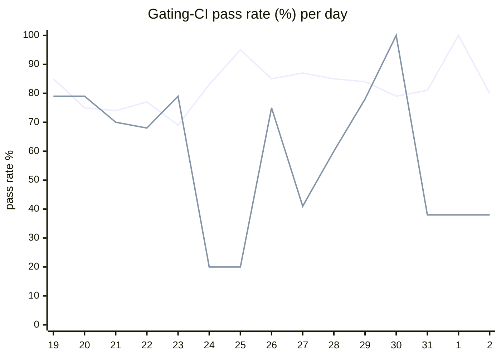

# CI Health Dashboard

_Window: last 14 days (trend + pass rate) · tables: last 24h · updated 2026-08-02T07:05:50Z · auto-generated, do not edit by hand._

**Gating-CI pass rate** — PR: 79% (1889/2386) · main: 68% (97/143)

## Gating-CI pass-rate trend

```mermaid
xychart-beta
  title "Gating-CI pass rate (%) per day"
  x-axis [19, 20, 21, 22, 23, 24, 25, 26, 27, 28, 29, 30, 31, 1, 2]
  y-axis "pass rate %" 0 --> 100
  line "CI" [85, 75, 74, 77, 69, 83, 95, 85, 87, 85, 84, 79, 81, 100, 80]
  line "main" [79, 79, 70, 68, 79, 20, 20, 75, 41, 60, 78, 100, 38, 38, 38]
```

_X-axis = day of month (Jul 19 → Aug 02). Two lines: **CI** (PR gating-CI runs, generally the upper line) and **main** (post-merge main runs, lower). Y-axis = % of that day's gating-CI runs that passed._

## Top 10 failing jobs (last 24h)

| # | job | workflow | fails | recovered | runs | fail rate | flaky? | scope | cause |
| --- | --- | --- | --- | --- | --- | --- | --- | --- | --- |
| 1 | `build` | frontend / app | 1 | 0 | 3 | 33% | flaky | PR | **infra/CI** — frontend/app build fails: TypeScript cannot find jsdom module or types |
| 2 | `test` | frontend / app | 1 | 0 | 3 | 33% | flaky | PR | **infra/CI** — frontend/app unit tests fail: jsdom package not declared in package.json |
| 3 | `authdisabled` | build | 1 | 0 | 3 | 33% | flaky | PR | **infra/CI** — Docker authdisabled build fails: frontend tsc cannot resolve missing jsdom devDependency |
| 4 | `frontend` | build | 1 | 0 | 3 | 33% | flaky | PR | **infra/CI** — build workflow frontend test step fails: jsdom package not installed |
| 5 | `lite-amd` | build | 1 | 0 | 3 | 33% | flaky | PR | **infra/CI** — Docker dashboard/lite build fails: frontend tsc cannot resolve missing jsdom devDependency |
| 6 | `dashboard-amd` | build | 1 | 0 | 3 | 33% | flaky | PR | **infra/CI** — Docker dashboard-amd build fails: frontend tsc cannot resolve missing jsdom devDependency |
| 7 | `lite-arm` | build | 1 | 0 | 3 | 33% | flaky | PR | **infra/CI** — Docker lite-arm build fails: frontend tsc cannot resolve missing jsdom devDependency |
| 8 | `dashboard-arm` | build | 1 | 0 | 3 | 33% | flaky | PR | **infra/CI** — Docker dashboard-arm build fails: frontend tsc cannot resolve missing jsdom devDependency |

## Top 10 failing tests (last 24h)

| # | test | job | fails | runs | fail rate | flaky? | scope | cause |
| --- | --- | --- | --- | --- | --- | --- | --- | --- |
| 1 | `(unparsed)` | `build` | 1 | 3 | 33% | flaky | PR | **infra/CI** — frontend/app build fails: TypeScript cannot find jsdom module or types |
| 2 | `(unparsed)` | `test` | 1 | 3 | 33% | flaky | PR | **infra/CI** — frontend/app unit tests fail: jsdom package not declared in package.json |
| 3 | `(unparsed)` | `authdisabled` | 1 | 3 | 33% | flaky | PR | **infra/CI** — Docker authdisabled build fails: frontend tsc cannot resolve missing jsdom devDependency |
| 4 | `(unparsed)` | `frontend` | 1 | 3 | 33% | flaky | PR | **infra/CI** — build workflow frontend test step fails: jsdom package not installed |
| 5 | `(unparsed)` | `lite-amd` | 1 | 3 | 33% | flaky | PR | **infra/CI** — Docker dashboard/lite build fails: frontend tsc cannot resolve missing jsdom devDependency |
| 6 | `(unparsed)` | `dashboard-amd` | 1 | 3 | 33% | flaky | PR | **infra/CI** — Docker dashboard-amd build fails: frontend tsc cannot resolve missing jsdom devDependency |
| 7 | `(unparsed)` | `lite-arm` | 1 | 3 | 33% | flaky | PR | **infra/CI** — Docker lite-arm build fails: frontend tsc cannot resolve missing jsdom devDependency |
| 8 | `(unparsed)` | `dashboard-arm` | 1 | 3 | 33% | flaky | PR | **infra/CI** — Docker dashboard-arm build fails: frontend tsc cannot resolve missing jsdom devDependency |

## Recent CI-health wins (`ci-health`)

**Recently merged**

- https://github.com/hatchet-dev/hatchet/pull/4239
- https://github.com/hatchet-dev/hatchet/pull/4238
- https://github.com/hatchet-dev/hatchet/pull/4218
- https://github.com/hatchet-dev/hatchet/pull/4213
- https://github.com/hatchet-dev/hatchet/pull/4165

**Open**

_No open `ci-health` PRs yet._

---
_Trend and pass-rate totals cover the last 14 days; job/test tables cover the last 24h._ **fails** = gating runs where the job/test failed · **recovered** = failed on a first attempt but passed on re-run (a flakiness signal) · **runs** = total gating runs of that workflow · **fail rate** = fails ÷ runs · **flaky** = recovered on re-run or intermittent across runs; **deterministic** = fails every time it runs · **scope** = whether failures were seen on PR, main, or main + PR.
