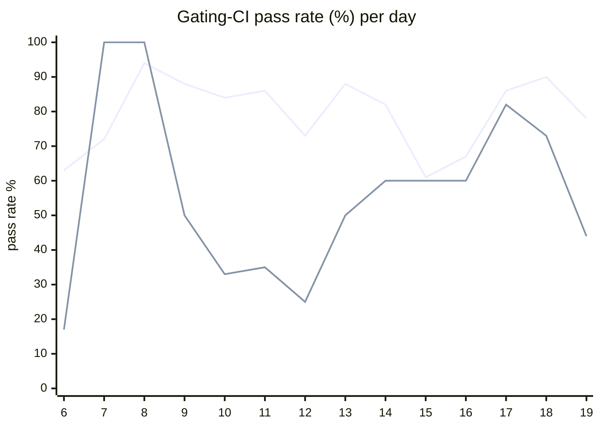

# CI Health Dashboard

_Window: last 14 days (trend + pass rate) · tables: last 24h · updated 2026-08-20T07:11:06Z · auto-generated, do not edit by hand._

**Gating-CI pass rate** — PR: 81% (1873/2325) · main: 51% (59/116)

## Gating-CI pass-rate trend

```mermaid
xychart-beta
  title "Gating-CI pass rate (%) per day"
  x-axis [6, 7, 8, 9, 10, 11, 12, 13, 14, 15, 16, 17, 18, 19]
  y-axis "pass rate %" 0 --> 100
  line "CI" [63, 72, 94, 88, 84, 86, 73, 88, 82, 61, 67, 86, 90, 78]
  line "main" [17, 100, 100, 50, 33, 35, 25, 50, 60, 60, 60, 82, 73, 44]
```

_X-axis = day of month (Aug 06 → Aug 19). Two lines: **CI** (PR gating-CI runs, generally the upper line) and **main** (post-merge main runs, lower). Y-axis = % of that day's gating-CI runs that passed._

## Top 10 failing jobs (last 24h)

| # | job | workflow | fails | recovered | runs | fail rate | flaky? | scope | cause |
| --- | --- | --- | --- | --- | --- | --- | --- | --- | --- |
| 1 | `unit` | test | 31 | 0 | 69 | 45% | flaky | main + PR | **product bug** — GetTaskStats SQL UNION column count mismatch (SQLSTATE 42601) |
| 2 | `load-online-migrate` | test | 15 | 0 | 69 | 22% | flaky | main + PR | **product bug** — Seed fails: TenantMember.canViewPayloads column missing after migration |
| 3 | `integration` | test | 8 | 0 | 69 | 12% | flaky | main + PR | **product bug** — RBAC viewer role denies WorkflowUpdatePause; expected authorize=true |
| 4 | `generate` | test | 8 | 0 | 69 | 12% | flaky | PR | **infra/CI** — test/generate prettier check-for-diff drift on frontend files |
| 5 | `lint` | ruby | 7 | 0 | 51 | 14% | flaky | PR | **infra/CI** — Ruby SDK generated bindings out of date vs OpenAPI spec |
| 6 | `rampup` | test | 6 | 1 | 69 | 9% | flaky | PR | **product bug** — RBAC viewer role denies WorkflowUpdatePause; expected authorize=true |
| 7 | `e2e-pgmq` | test | 6 | 0 | 69 | 9% | flaky | PR | **product bug** — RBAC viewer role denies WorkflowUpdatePause; expected authorize=true |
| 8 | `test` | ruby | 5 | 0 | 51 | 10% | flaky | PR | **flaky test** — Ruby non_retryable e2e: retry event count assertion intermittently fails |
| 9 | `test` | python | 5 | 0 | 65 | 8% | flaky | PR | **timeout** — Python S3 worker example test exceeded 60s pytest-timeout budget |
| 10 | `e2e` | test | 5 | 0 | 69 | 7% | flaky | PR | **product bug** — RBAC viewer role denies WorkflowUpdatePause; expected authorize=true |

## Top 10 failing tests (last 24h)

| # | test | job | fails | runs | fail rate | flaky? | scope | cause |
| --- | --- | --- | --- | --- | --- | --- | --- | --- |
| 1 | `TestGetTaskStats` | `unit` | 20 | 69 | 29% | flaky | main + PR | **product bug** — GetTaskStats SQL UNION column count mismatch (SQLSTATE 42601) |
| 2 | `TestGetTaskStats/duplicate_strategies_count_one_running_attempt` | `unit` | 20 | 69 | 29% | flaky | main + PR | **product bug** — GetTaskStats SQL UNION column count mismatch (SQLSTATE 42601) |
| 3 | `examples/aws/s3/test_worker.py::test_pipeline_processes_and_deletes_all_objects[on_demand_worker0]` | `test` | 15 | 65 | 23% | flaky | main + PR | **timeout** — Python S3 worker example test exceeded 60s pytest-timeout budget |
| 4 | `(unparsed)` | `load-online-migrate` | 15 | 69 | 22% | flaky | main + PR | **product bug** — Seed fails: TenantMember.canViewPayloads column missing after migration |
| 5 | `(unparsed)` | `lint` | 9 | 65 | 14% | flaky | PR | **product bug** — Corrupted poetry.lock: Cannot overwrite a value at line 698 |
| 6 | `(unparsed)` | `test` | 9 | 65 | 14% | flaky | PR | **product bug** — Corrupted poetry.lock: Cannot overwrite a value at line 698 |
| 7 | `(unparsed)` | `generate` | 8 | 69 | 12% | flaky | PR | **infra/CI** — test/generate prettier check-for-diff drift on frontend files |
| 8 | `(unparsed)` | `lint` | 7 | 51 | 14% | flaky | PR | **infra/CI** — Ruby SDK generated bindings out of date vs OpenAPI spec |
| 9 | `(unparsed)` | `lint` | 6 | 57 | 10% | flaky | PR | **infra/CI** — TypeScript SDK generated bindings out of date vs OpenAPI spec |
| 10 | `./non_retryable/test_no_retry_spec.rb:7` | `test` | 5 | 51 | 10% | flaky | PR | **flaky test** — Ruby non_retryable e2e: retry event count assertion intermittently fails |

## Recent CI-health wins (`ci-health`)

**Recently merged**

- https://github.com/hatchet-dev/hatchet/pull/4239
- https://github.com/hatchet-dev/hatchet/pull/4238
- https://github.com/hatchet-dev/hatchet/pull/4218
- https://github.com/hatchet-dev/hatchet/pull/4213
- https://github.com/hatchet-dev/hatchet/pull/4165

**Open**

_No open `ci-health` PRs yet._

---
_Trend and pass-rate totals cover the last 14 days; job/test tables cover the last 24h._ **fails** = gating runs where the job/test failed · **recovered** = failed on a first attempt but passed on re-run (a flakiness signal) · **runs** = total gating runs of that workflow · **fail rate** = fails ÷ runs · **flaky** = recovered on re-run or intermittent across runs; **deterministic** = fails every time it runs · **scope** = whether failures were seen on PR, main, or main + PR.
