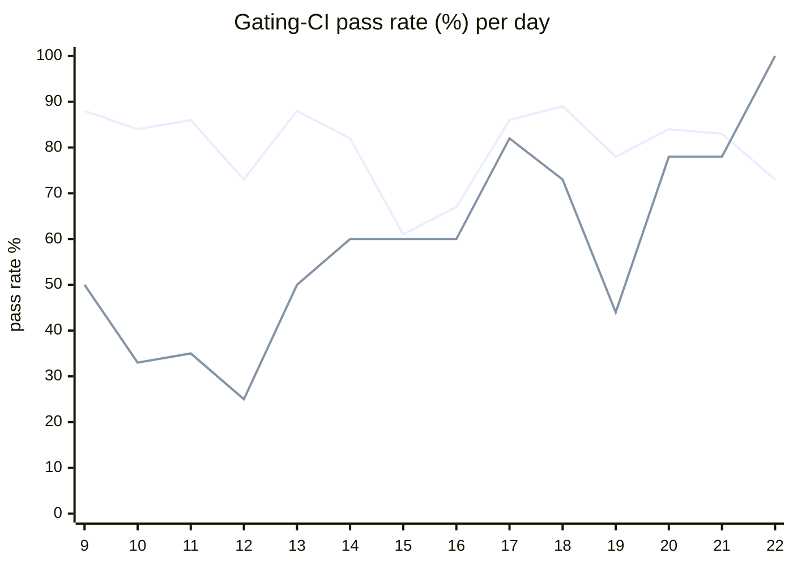

# CI Health Dashboard

_Window: last 14 days (trend + pass rate) · tables: last 24h · updated 2026-08-23T07:09:08Z · auto-generated, do not edit by hand._

**Gating-CI pass rate** — PR: 82% (2018/2465) · main: 59% (87/147)

## Gating-CI pass-rate trend

```mermaid
xychart-beta
  title "Gating-CI pass rate (%) per day"
  x-axis [9, 10, 11, 12, 13, 14, 15, 16, 17, 18, 19, 20, 21, 22]
  y-axis "pass rate %" 0 --> 100
  line "CI" [88, 84, 86, 73, 88, 82, 61, 67, 86, 89, 78, 84, 83, 73]
  line "main" [50, 33, 35, 25, 50, 60, 60, 60, 82, 73, 44, 78, 78, 100]
```

_X-axis = day of month (Aug 09 → Aug 22). Two lines: **CI** (PR gating-CI runs, generally the upper line) and **main** (post-merge main runs, lower). Y-axis = % of that day's gating-CI runs that passed._

## Top 10 failing jobs (last 24h)

| # | job | workflow | fails | recovered | runs | fail rate | flaky? | scope | cause |
| --- | --- | --- | --- | --- | --- | --- | --- | --- | --- |
| 1 | `unit` | test | 2 | 0 | 5 | 40% | flaky | PR | **flaky test** — TestMsgIdBufferMemoryLeak unit test intermittently fails on buffer size assertions |
| 2 | `test` | python | 2 | 0 | 7 | 29% | flaky | PR | **infra/CI** — Python SDK poetry.lock out of sync with pyproject.toml during test install |
| 3 | `generate` | test | 1 | 0 | 5 | 20% | flaky | PR | **infra/CI** — test/generate codegen or prettier drift fails git diff --exit-code |

## Top 10 failing tests (last 24h)

| # | test | job | fails | runs | fail rate | flaky? | scope | cause |
| --- | --- | --- | --- | --- | --- | --- | --- | --- |
| 1 | `TestMsgIdBufferMemoryLeak` | `unit` | 2 | 5 | 40% | flaky | PR | **flaky test** — TestMsgIdBufferMemoryLeak unit test intermittently fails on buffer size assertions |
| 2 | `(unparsed)` | `lint` | 2 | 7 | 29% | flaky | PR | **infra/CI** — Python SDK poetry.lock out of sync with pyproject.toml during lint install |
| 3 | `(unparsed)` | `test` | 2 | 7 | 29% | flaky | PR | **infra/CI** — Python SDK poetry.lock out of sync with pyproject.toml during test install |
| 4 | `(unparsed)` | `generate` | 1 | 5 | 20% | flaky | PR | **infra/CI** — test/generate codegen or prettier drift fails git diff --exit-code |
| 5 | `examples/conditions/test_conditions.py::test_skip_if_sleep_runs_when_event_wins` | `test` | 1 | 7 | 14% | flaky | PR | **flaky test** — Python conditions skip_if_sleep vs event race in example test |
| 6 | `examples/conditions/test_conditions.py::test_cancel_if_user_event` | `test` | 1 | 7 | 14% | flaky | PR | **flaky test** — Python conditions cancel_if_user_event race: COMPLETED vs CANCELLED status |
| 7 | `tests/zombie_worker/test_zombie_worker.py::test_zombie_worker[on_demand_worker0]` | `test` | 1 | 7 | 14% | flaky | PR | **flaky test** — Python zombie_worker on_demand_worker assertion races on worker heartbeat timing |

## Recent CI-health wins (`ci-health`)

**Recently merged**

- https://github.com/hatchet-dev/hatchet/pull/4239
- https://github.com/hatchet-dev/hatchet/pull/4238
- https://github.com/hatchet-dev/hatchet/pull/4218
- https://github.com/hatchet-dev/hatchet/pull/4213
- https://github.com/hatchet-dev/hatchet/pull/4165

**Open**

_No open `ci-health` PRs yet._

---
_Trend and pass-rate totals cover the last 14 days; job/test tables cover the last 24h._ **fails** = gating runs where the job/test failed · **recovered** = failed on a first attempt but passed on re-run (a flakiness signal) · **runs** = total gating runs of that workflow · **fail rate** = fails ÷ runs · **flaky** = recovered on re-run or intermittent across runs; **deterministic** = fails every time it runs · **scope** = whether failures were seen on PR, main, or main + PR.
