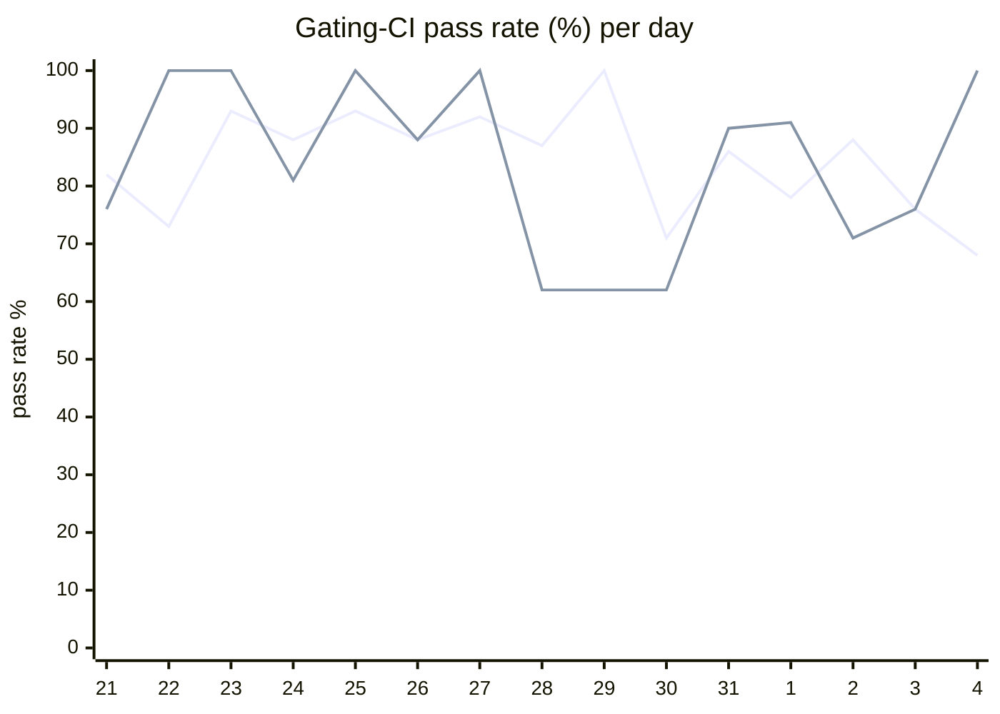

# CI Health Dashboard

_Window: last 14 days (trend + pass rate) · tables: last 24h · updated 2026-09-04T07:12:04Z · auto-generated, do not edit by hand._

**Gating-CI pass rate** — PR: 85% (2309/2730) · main: 83% (138/166)

## Gating-CI pass-rate trend

```mermaid
xychart-beta
  title "Gating-CI pass rate (%) per day"
  x-axis [21, 22, 23, 24, 25, 26, 27, 28, 29, 30, 31, 1, 2, 3, 4]
  y-axis "pass rate %" 0 --> 100
  line "CI" [82, 73, 93, 88, 93, 88, 92, 87, 100, 71, 86, 78, 88, 76, 68]
  line "main" [76, 100, 100, 81, 100, 88, 100, 62, 62, 62, 90, 91, 71, 76, 100]
```

_X-axis = day of month (Aug 21 → Sep 04). Two lines: **CI** (PR gating-CI runs, generally the upper line) and **main** (post-merge main runs, lower). Y-axis = % of that day's gating-CI runs that passed._

## Top 10 failing jobs (last 24h)

| # | job | workflow | fails | recovered | runs | fail rate | flaky? | scope | cause |
| --- | --- | --- | --- | --- | --- | --- | --- | --- | --- |
| 1 | `build` | frontend / docs | 9 | 0 | 24 | 38% | flaky | PR | **infra/CI** — frontend/docs prettier drift on migration-guide-python-v2.mdx |
| 2 | `lint` | ruby | 8 | 0 | 28 | 29% | flaky | PR | **infra/CI** — Ruby protobuf/REST generated bindings out of date |
| 3 | `unit` | test | 7 | 0 | 38 | 18% | flaky | main + PR | **product bug** — duplicate dagoperator methods block test/unit compile |
| 4 | `test-templates` | cli-e2e-tests | 6 | 0 | 14 | 43% | flaky | main + PR | **flaky test** — CLI TestQuickstartTemplates parent E2E template timing |
| 5 | `integration` | test | 6 | 0 | 38 | 16% | flaky | main + PR | **product bug** — duplicate dagoperator methods block test/integration generate |
| 6 | `generate` | test | 6 | 0 | 38 | 16% | flaky | PR | **product bug** — test/generate fails golangci-lint on duplicate dagoperator methods |
| 7 | `test` | ruby | 5 | 0 | 28 | 18% | flaky | main + PR | **product bug** — duplicate method reportBlockedOnDurableEvents in dagoperator/dag.go |
| 8 | `cypress` | frontend / app | 5 | 0 | 33 | 15% | flaky | PR | **product bug** — duplicate dagoperator methods block ruby test job setup compile |
| 9 | `test` | python | 5 | 0 | 44 | 11% | flaky | PR | **product bug** — Python durable sleep cancel replay KeyError on runtime payload |
| 10 | `lint` | lint all | 5 | 0 | 46 | 11% | flaky | PR | **infra/CI** — lint all pre-commit failure (changelog formatting drift) |

## Top 10 failing tests (last 24h)

| # | test | job | fails | runs | fail rate | flaky? | scope | cause |
| --- | --- | --- | --- | --- | --- | --- | --- | --- |
| 1 | `examples/conditions/test_conditions.py::test_waits` | `test` | 10 | 44 | 23% | flaky | PR | **flaky test** — conditions test_waits times out waiting for workflow start (60s) |
| 2 | `(unparsed)` | `build` | 9 | 24 | 38% | flaky | PR | **infra/CI** — frontend/docs prettier drift on migration-guide-python-v2.mdx |
| 3 | `examples/bug_tests/payload_bug_on_replay/test_payload_replay_bug.py::test_payload_replay_bug` | `test` | 9 | 44 | 20% | flaky | main + PR | **product bug** — Python payload replay bug KeyError step2 on replay |
| 4 | `(unparsed)` | `lint` | 7 | 28 | 25% | flaky | PR | **infra/CI** — Ruby protobuf/REST generated bindings out of date |
| 5 | `(unparsed)` | `lint` | 7 | 33 | 21% | flaky | PR | **infra/CI** — TypeScript protobuf/REST generated bindings out of date |
| 6 | `(unparsed)` | `lint` | 7 | 44 | 16% | flaky | PR | **infra/CI** — Python protobuf/REST generated bindings out of date |
| 7 | `examples/durable/test_durable.py::test_durable_sleep_cancel_replay` | `test` | 7 | 44 | 16% | flaky | main + PR | **product bug** — Python durable sleep cancel replay KeyError on runtime payload |
| 8 | `TestQuickstartTemplates` | `test-templates` | 5 | 14 | 36% | flaky | main + PR | **flaky test** — CLI TestQuickstartTemplates parent E2E template timing |
| 9 | `TestQuickstartTemplates/simple_go_go` | `test-templates` | 5 | 14 | 36% | flaky | main + PR | **flaky test** — CLI TestQuickstartTemplates/simple_go_go E2E template timing |
| 10 | `(unparsed)` | `lint` | 5 | 46 | 11% | flaky | PR | **infra/CI** — lint all pre-commit failure (changelog formatting drift) |

## Recent CI-health wins (`ci-health`)

**Recently merged**

- https://github.com/hatchet-dev/hatchet/pull/4239
- https://github.com/hatchet-dev/hatchet/pull/4238
- https://github.com/hatchet-dev/hatchet/pull/4218
- https://github.com/hatchet-dev/hatchet/pull/4213
- https://github.com/hatchet-dev/hatchet/pull/4165

**Open**

_No open `ci-health` PRs yet._

---
_Trend and pass-rate totals cover the last 14 days; job/test tables cover the last 24h._ **fails** = gating runs where the job/test failed · **recovered** = failed on a first attempt but passed on re-run (a flakiness signal) · **runs** = total gating runs of that workflow · **fail rate** = fails ÷ runs · **flaky** = recovered on re-run or intermittent across runs; **deterministic** = fails every time it runs · **scope** = whether failures were seen on PR, main, or main + PR.
