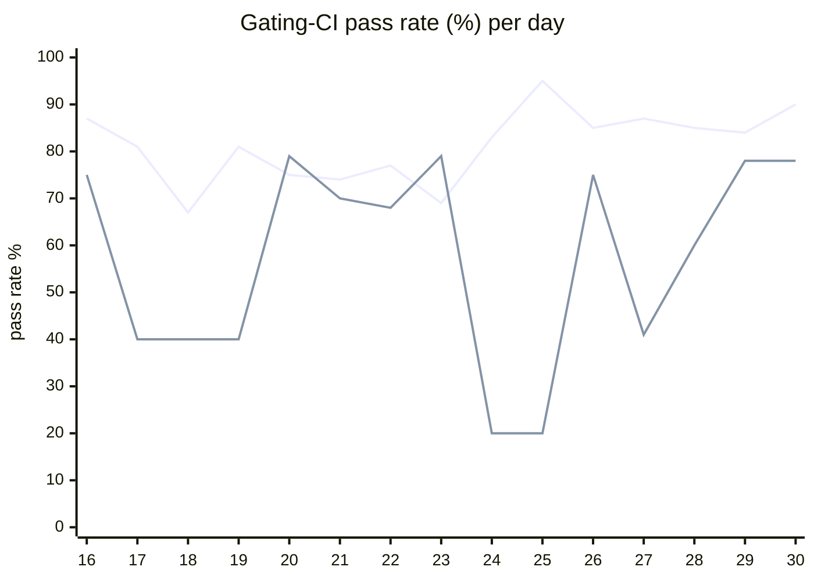

# CI Health Dashboard

_Window: last 14 days (trend + pass rate) · tables: last 24h · updated 2026-07-30T07:08:32Z · auto-generated, do not edit by hand._

**Gating-CI pass rate** — PR: 80% (1977/2482) · main: 68% (100/148)

## Gating-CI pass-rate trend

```mermaid
xychart-beta
  title "Gating-CI pass rate (%) per day"
  x-axis [16, 17, 18, 19, 20, 21, 22, 23, 24, 25, 26, 27, 28, 29, 30]
  y-axis "pass rate %" 0 --> 100
  line "CI" [87, 81, 67, 81, 75, 74, 77, 69, 83, 95, 85, 87, 85, 84, 90]
  line "main" [75, 40, 40, 40, 79, 70, 68, 79, 20, 20, 75, 41, 60, 78, 78]
```

_X-axis = day of month (Jul 16 → Jul 30). Two lines: **CI** (PR gating-CI runs, generally the upper line) and **main** (post-merge main runs, lower). Y-axis = % of that day's gating-CI runs that passed._

## Top 10 failing jobs (last 24h)

| # | job | workflow | fails | recovered | runs | fail rate | flaky? | scope | cause |
| --- | --- | --- | --- | --- | --- | --- | --- | --- | --- |
| 1 | `e2e-pgmq` | test | 12 | 0 | 56 | 21% | flaky | main + PR | **flaky test** — TestMultipleEvictionCycle e2e durable eviction timing is non-deterministic |
| 2 | `e2e` | test | 7 | 0 | 56 | 12% | flaky | PR | **infra/CI** — e2e job timed out waiting for Hatchet engine/API to become ready |
| 3 | `generate` | test | 7 | 0 | 56 | 12% | flaky | PR | **product bug** — generate-docs task fails golangci-lint typecheck on durable_ordered_release.go |
| 4 | `integration` | test | 6 | 0 | 56 | 11% | flaky | main + PR | **product bug** — integration tests fail compiling durable_ordered_release.go (gates/gateMu undefined) |
| 5 | `rampup` | test | 6 | 0 | 56 | 11% | flaky | PR | **product bug** — goose migration 20260722000000_batching_consolidated parse error blocks rampup test engine startup |
| 6 | `compile` | go | 5 | 0 | 32 | 16% | flaky | PR | **product bug** — Go SDK durable_ordered_release references missing gates/gateMu on DurableTaskListener |
| 7 | `unit` | test | 5 | 0 | 56 | 9% | flaky | PR | **product bug** — unit tests fail compiling pkg/client/durable_ordered_release.go (gates/gateMu undefined) |
| 8 | `load` | test | 4 | 0 | 56 | 7% | flaky | main + PR | **product bug** — load tests fail when engine startup hits migration parse or durable_ordered_release compile errors |
| 9 | `loadtest` | build | 3 | 0 | 46 | 6% | flaky | PR | **product bug** — loadtest Docker build fails compiling durable_ordered_release.go (gates/gateMu undefined) |
| 10 | `loadtest-arm` | build | 3 | 0 | 46 | 6% | flaky | PR | **product bug** — loadtest-arm Docker build fails compiling durable_ordered_release.go (gates/gateMu undefined) |

## Top 10 failing tests (last 24h)

| # | test | job | fails | runs | fail rate | flaky? | scope | cause |
| --- | --- | --- | --- | --- | --- | --- | --- | --- |
| 1 | `examples/conditions/test_conditions.py::test_waits` | `test` | 7 | 32 | 22% | flaky | PR | **flaky test** — Python test_waits non-deterministic: skipped vs random_number outcome varies |
| 2 | `TestMultipleEvictionCycle` | `e2e-pgmq` | 7 | 56 | 12% | flaky | main + PR | **flaky test** — TestMultipleEvictionCycle e2e durable eviction timing is non-deterministic |
| 3 | `(unparsed)` | `load` | 5 | 56 | 9% | flaky | PR | **product bug** — load tests fail when engine startup hits migration parse or durable_ordered_release compile errors |
| 4 | `(unparsed)` | `rampup` | 5 | 56 | 9% | flaky | PR | **product bug** — goose migration 20260722000000_batching_consolidated parse error blocks rampup test engine startup |
| 5 | `(unparsed)` | `e2e-pgmq` | 4 | 56 | 7% | flaky | PR | **infra/CI** — e2e-pgmq job timed out waiting for Hatchet engine/API to become ready |
| 6 | `(unparsed)` | `e2e` | 4 | 56 | 7% | flaky | PR | **infra/CI** — e2e job timed out waiting for Hatchet engine/API to become ready |
| 7 | `(unparsed)` | `compile` | 3 | 32 | 9% | flaky | PR | **product bug** — Go SDK durable_ordered_release references missing gates/gateMu on DurableTaskListener |
| 8 | `(unparsed)` | `loadtest` | 3 | 46 | 6% | flaky | PR | **product bug** — loadtest Docker build fails compiling durable_ordered_release.go (gates/gateMu undefined) |
| 9 | `(unparsed)` | `loadtest-arm` | 3 | 46 | 6% | flaky | PR | **product bug** — loadtest-arm Docker build fails compiling durable_ordered_release.go (gates/gateMu undefined) |
| 10 | `(unparsed)` | `lint` | 3 | 49 | 6% | flaky | PR | **product bug** — pre-commit golangci-lint fails typecheck on durable_ordered_release.go |

## Recent CI-health wins (`ci-health`)

**Recently merged**

- https://github.com/hatchet-dev/hatchet/pull/4239
- https://github.com/hatchet-dev/hatchet/pull/4238
- https://github.com/hatchet-dev/hatchet/pull/4218
- https://github.com/hatchet-dev/hatchet/pull/4213
- https://github.com/hatchet-dev/hatchet/pull/4165

**Open**

_No open `ci-health` PRs yet._

---
_Trend and pass-rate totals cover the last 14 days; job/test tables cover the last 24h._ **fails** = gating runs where the job/test failed · **recovered** = failed on a first attempt but passed on re-run (a flakiness signal) · **runs** = total gating runs of that workflow · **fail rate** = fails ÷ runs · **flaky** = recovered on re-run or intermittent across runs; **deterministic** = fails every time it runs · **scope** = whether failures were seen on PR, main, or main + PR.
