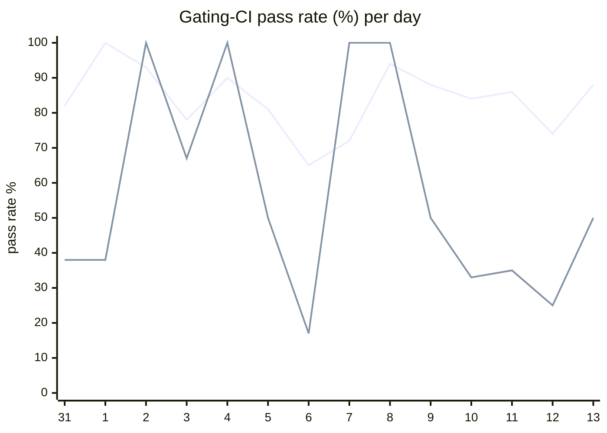

# CI Health Dashboard

_Window: last 14 days (trend + pass rate) · tables: last 24h · updated 2026-08-14T07:19:03Z · auto-generated, do not edit by hand._

**Gating-CI pass rate** — PR: 81% (1508/1862) · main: 46% (40/86)

## Gating-CI pass-rate trend

```mermaid
xychart-beta
  title "Gating-CI pass rate (%) per day"
  x-axis [31, 1, 2, 3, 4, 5, 6, 7, 8, 9, 10, 11, 12, 13]
  y-axis "pass rate %" 0 --> 100
  line "CI" [82, 100, 93, 78, 90, 81, 65, 72, 94, 88, 84, 86, 74, 88]
  line "main" [38, 38, 100, 67, 100, 50, 17, 100, 100, 50, 33, 35, 25, 50]
```

_X-axis = day of month (Jul 31 → Aug 13). Two lines: **CI** (PR gating-CI runs, generally the upper line) and **main** (post-merge main runs, lower). Y-axis = % of that day's gating-CI runs that passed._

## Top 10 failing jobs (last 24h)

| # | job | workflow | fails | recovered | runs | fail rate | flaky? | scope | cause |
| --- | --- | --- | --- | --- | --- | --- | --- | --- | --- |
| 1 | `rampup` | test | 8 | 0 | 12 | 67% | flaky | main + PR | **timeout** — TestRampUp exceeded ~300s CI job timeout (311s) |
| 2 | `e2e-pgmq` | test | 2 | 0 | 12 | 17% | flaky | PR | **flaky test** — TestMultipleEvictionCycle fails intermittently across PRs (~31s) |
| 3 | `cypress` | frontend / app | 1 | 0 | 6 | 17% | flaky | PR | **product bug** — Cypress auth/onboarding redirect assertions fail (missing login form elements) |
| 4 | `build` | frontend / app | 1 | 0 | 6 | 17% | flaky | PR | **product bug** — TypeScript build: cannot find module @/hooks/use-can-write |
| 5 | `dashboard-amd` | build | 1 | 0 | 10 | 10% | flaky | PR | **product bug** — Docker dashboard-amd build failed: frontend npm run build TS errors |
| 6 | `dashboard-arm` | build | 1 | 0 | 10 | 10% | flaky | PR | **product bug** — Docker dashboard-arm build failed: frontend npm run build TS errors |
| 7 | `frontend` | build | 1 | 0 | 10 | 10% | flaky | PR | **product bug** — Frontend Docker build failed: missing @/hooks/use-can-write module (TS2307) |
| 8 | `authdisabled` | build | 1 | 0 | 10 | 10% | flaky | PR | **product bug** — Docker authdisabled build failed: frontend npm run build TS errors |
| 9 | `lite-amd` | build | 1 | 0 | 10 | 10% | flaky | PR | **product bug** — Docker lite-amd build failed: frontend npm run build TS errors (missing use-can-write) |
| 10 | `lite-arm` | build | 1 | 0 | 10 | 10% | flaky | PR | **product bug** — Docker lite-arm build failed: frontend npm run build TS errors (missing use-can-write) |

## Top 10 failing tests (last 24h)

| # | test | job | fails | runs | fail rate | flaky? | scope | cause |
| --- | --- | --- | --- | --- | --- | --- | --- | --- |
| 1 | `TestRampUp` | `rampup` | 7 | 12 | 58% | flaky | main + PR | **timeout** — TestRampUp exceeded ~300s CI job timeout (311s) |
| 2 | `TestRampUp/normal_test` | `rampup` | 7 | 12 | 58% | flaky | main + PR | **timeout** — TestRampUp/normal_test exceeded ~300s CI job timeout (310s) |
| 3 | `TestMultipleEvictionCycle` | `e2e-pgmq` | 2 | 12 | 17% | flaky | PR | **flaky test** — TestMultipleEvictionCycle fails intermittently across PRs (~31s) |
| 4 | `(unparsed)` | `cypress` | 1 | 6 | 17% | flaky | PR | **product bug** — Cypress auth/onboarding redirect assertions fail (missing login form elements) |
| 5 | `(unparsed)` | `build` | 1 | 6 | 17% | flaky | PR | **product bug** — TypeScript build: cannot find module @/hooks/use-can-write |
| 6 | `./non_retryable/test_no_retry_spec.rb:7` | `test` | 1 | 8 | 12% | flaky | PR | **flaky test** — Ruby e2e NonRetryableWorkflow retry event count assertion is timing-sensitive |
| 7 | `(unparsed)` | `dashboard-amd` | 1 | 10 | 10% | flaky | PR | **product bug** — Docker dashboard-amd build failed: frontend npm run build TS errors |
| 8 | `(unparsed)` | `dashboard-arm` | 1 | 10 | 10% | flaky | PR | **product bug** — Docker dashboard-arm build failed: frontend npm run build TS errors |
| 9 | `(unparsed)` | `frontend` | 1 | 10 | 10% | flaky | PR | **product bug** — Frontend Docker build failed: missing @/hooks/use-can-write module (TS2307) |
| 10 | `(unparsed)` | `authdisabled` | 1 | 10 | 10% | flaky | PR | **product bug** — Docker authdisabled build failed: frontend npm run build TS errors |

## Recent CI-health wins (`ci-health`)

**Recently merged**

- https://github.com/hatchet-dev/hatchet/pull/4239
- https://github.com/hatchet-dev/hatchet/pull/4238
- https://github.com/hatchet-dev/hatchet/pull/4218
- https://github.com/hatchet-dev/hatchet/pull/4213
- https://github.com/hatchet-dev/hatchet/pull/4165

**Open**

_No open `ci-health` PRs yet._

---
_Trend and pass-rate totals cover the last 14 days; job/test tables cover the last 24h._ **fails** = gating runs where the job/test failed · **recovered** = failed on a first attempt but passed on re-run (a flakiness signal) · **runs** = total gating runs of that workflow · **fail rate** = fails ÷ runs · **flaky** = recovered on re-run or intermittent across runs; **deterministic** = fails every time it runs · **scope** = whether failures were seen on PR, main, or main + PR.
