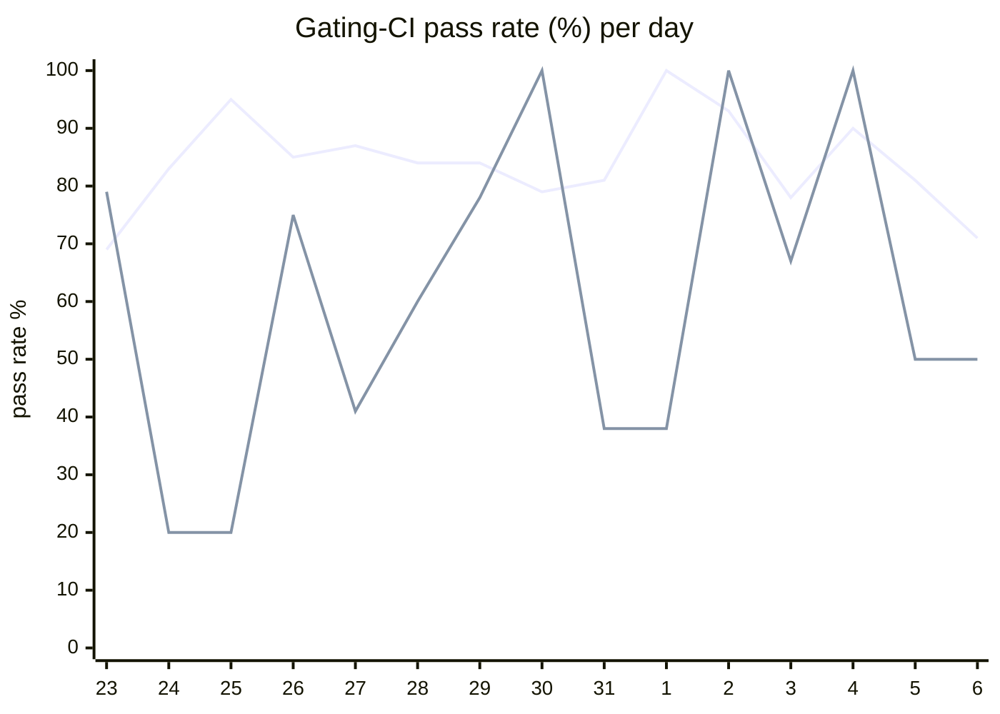

# CI Health Dashboard

_Window: last 14 days (trend + pass rate) · tables: last 24h · updated 2026-08-06T07:05:12Z · auto-generated, do not edit by hand._

**Gating-CI pass rate** — PR: 82% (1807/2210) · main: 65% (70/107)

## Gating-CI pass-rate trend

```mermaid
xychart-beta
  title "Gating-CI pass rate (%) per day"
  x-axis [23, 24, 25, 26, 27, 28, 29, 30, 31, 1, 2, 3, 4, 5, 6]
  y-axis "pass rate %" 0 --> 100
  line "CI" [69, 83, 95, 85, 87, 84, 84, 79, 81, 100, 93, 78, 90, 81, 71]
  line "main" [79, 20, 20, 75, 41, 60, 78, 100, 38, 38, 100, 67, 100, 50, 50]
```

_X-axis = day of month (Jul 23 → Aug 06). Two lines: **CI** (PR gating-CI runs, generally the upper line) and **main** (post-merge main runs, lower). Y-axis = % of that day's gating-CI runs that passed._

## Top 10 failing jobs (last 24h)

| # | job | workflow | fails | recovered | runs | fail rate | flaky? | scope | cause |
| --- | --- | --- | --- | --- | --- | --- | --- | --- | --- |
| 1 | `e2e-pgmq` | test | 10 | 0 | 31 | 32% | flaky | main + PR | **flaky test** — Durable eviction e2e (pgmq): second eviction cycle assertion fails intermittently |
| 2 | `e2e` | test | 7 | 0 | 31 | 23% | flaky | main + PR | **flaky test** — Durable eviction e2e: second eviction cycle assertion fails intermittently |
| 3 | `test` | ruby | 6 | 0 | 25 | 24% | flaky | PR | **infra/CI** — Ruby integration test: gRPC connection refused (engine not ready on :7070) |
| 4 | `integration` | test | 5 | 0 | 31 | 16% | flaky | main + PR | **unknown** — Sample is passing test log line, not a failure message |
| 5 | `rampup` | test | 5 | 0 | 31 | 16% | flaky | PR | **unknown** — Sample is go test command line only; actual failure not captured |
| 6 | `unit` | test | 4 | 0 | 31 | 13% | flaky | PR | **flaky test** — Concurrent partition controller test race (expected 4, got 3) |
| 7 | `generate` | test | 3 | 0 | 31 | 10% | flaky | PR | **unknown** — Sample is prettier output line, not a failure message |
| 8 | `load` | test | 3 | 0 | 31 | 10% | flaky | PR | **unknown** — Sample is go test command line only; actual failure not captured |
| 9 | `lint` | ruby | 2 | 0 | 25 | 8% | flaky | PR | **infra/CI** — Ruby generated bindings out of date (codegen check failed) |
| 10 | `test` | python | 2 | 0 | 25 | 8% | flaky | PR | **product bug** — Scheduling queuer.go compile error: GetStepBatchConfigs API mismatch on PR branch |

## Top 10 failing tests (last 24h)

| # | test | job | fails | runs | fail rate | flaky? | scope | cause |
| --- | --- | --- | --- | --- | --- | --- | --- | --- |
| 1 | `TestMultipleEvictionCycle` | `e2e-pgmq` | 6 | 31 | 19% | flaky | main + PR | **flaky test** — Durable eviction e2e (pgmq): second eviction cycle assertion fails intermittently |
| 2 | `examples/bulk_operations/test_bulk_replay.py::test_bulk_replay` | `test` | 3 | 25 | 12% | flaky | PR | **flaky test** — Python SDK worker startup times out in CI (25s budget) |
| 3 | `examples/cron/test_cron_input.py::test_cron_input_workflow_running_options` | `test` | 3 | 25 | 12% | flaky | PR | **flaky test** — Python SDK worker startup times out in CI (25s budget) |
| 4 | `examples/bug_tests/durable_child_key_duplicate_child/test_durable_child_key_duped_child.py::test_durable_child_key_duplicate_bug_all_duped` | `test` | 3 | 25 | 12% | flaky | PR | **flaky test** — Python SDK worker startup times out in CI (25s budget) |
| 5 | `examples/cancellation/test_cancellation.py::test_cancellation` | `test` | 3 | 25 | 12% | flaky | PR | **flaky test** — Python SDK worker startup times out in CI (25s budget) |
| 6 | `examples/bug_tests/durable_child_key_duplicate_child/test_durable_child_key_duped_child.py::test_durable_child_key_duplicate_bug_second_unique` | `test` | 3 | 25 | 12% | flaky | PR | **flaky test** — Python SDK worker startup times out in CI (25s budget) |
| 7 | `examples/durable/test_durable.py::test_durable_memoization_via_replay` | `test` | 3 | 25 | 12% | flaky | PR | **flaky test** — Python SDK worker startup times out in CI (25s budget) |
| 8 | `examples/durable_eviction/test_durable_eviction.py::test_evictable_task_restore` | `test` | 3 | 25 | 12% | flaky | PR | **flaky test** — Python SDK worker startup times out in CI (25s budget) |
| 9 | `examples/durable_eviction/test_durable_eviction.py::test_evictable_cancel_after_eviction` | `test` | 3 | 25 | 12% | flaky | PR | **flaky test** — Python SDK worker startup times out in CI (25s budget) |
| 10 | `examples/durable/test_durable.py::test_durable_memo_now_caching` | `test` | 3 | 25 | 12% | flaky | PR | **flaky test** — Python SDK worker startup times out in CI (25s budget) |

## Recent CI-health wins (`ci-health`)

**Recently merged**

- https://github.com/hatchet-dev/hatchet/pull/4239
- https://github.com/hatchet-dev/hatchet/pull/4238
- https://github.com/hatchet-dev/hatchet/pull/4218
- https://github.com/hatchet-dev/hatchet/pull/4213
- https://github.com/hatchet-dev/hatchet/pull/4165

**Open**

_No open `ci-health` PRs yet._

---
_Trend and pass-rate totals cover the last 14 days; job/test tables cover the last 24h._ **fails** = gating runs where the job/test failed · **recovered** = failed on a first attempt but passed on re-run (a flakiness signal) · **runs** = total gating runs of that workflow · **fail rate** = fails ÷ runs · **flaky** = recovered on re-run or intermittent across runs; **deterministic** = fails every time it runs · **scope** = whether failures were seen on PR, main, or main + PR.
