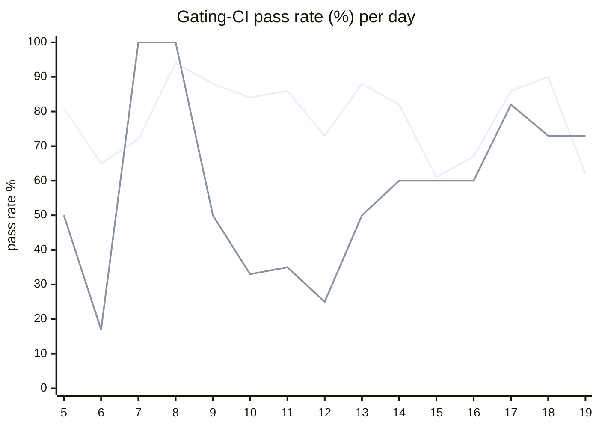

# CI Health Dashboard

_Window: last 14 days (trend + pass rate) · tables: last 24h · updated 2026-08-19T07:08:46Z · auto-generated, do not edit by hand._

**Gating-CI pass rate** — PR: 81% (1648/2043) · main: 53% (51/97)

## Gating-CI pass-rate trend

```mermaid
xychart-beta
  title "Gating-CI pass rate (%) per day"
  x-axis [5, 6, 7, 8, 9, 10, 11, 12, 13, 14, 15, 16, 17, 18, 19]
  y-axis "pass rate %" 0 --> 100
  line "CI" [81, 65, 72, 94, 88, 84, 86, 73, 88, 82, 61, 67, 86, 90, 62]
  line "main" [50, 17, 100, 100, 50, 33, 35, 25, 50, 60, 60, 60, 82, 73, 73]
```

_X-axis = day of month (Aug 05 → Aug 19). Two lines: **CI** (PR gating-CI runs, generally the upper line) and **main** (post-merge main runs, lower). Y-axis = % of that day's gating-CI runs that passed._

## Top 10 failing jobs (last 24h)

| # | job | workflow | fails | recovered | runs | fail rate | flaky? | scope | cause |
| --- | --- | --- | --- | --- | --- | --- | --- | --- | --- |
| 1 | `load-online-migrate` | test | 9 | 0 | 35 | 26% | flaky | main + PR | **product bug** — load-online-migrate seed fails: TenantMember.canViewPayloads column missing from DB schema |
| 2 | `unit` | test | 6 | 0 | 35 | 17% | flaky | main + PR | **flaky test** — TestMsgIdBufferMemoryLeak hits channel send timeouts under parallel goroutines in unit tests |
| 3 | `lint` | lint all | 6 | 0 | 41 | 15% | flaky | PR | **infra/CI** — pre-commit sync-python-changelog hook failed (changelog drift on PR branch) |
| 4 | `e2e-pgmq` | test | 5 | 0 | 35 | 14% | flaky | PR | **infra/CI** — e2e-pgmq job timed out waiting for Hatchet engine/API to become ready |
| 5 | `e2e` | test | 5 | 0 | 35 | 14% | flaky | PR | **infra/CI** — e2e job timed out waiting for Hatchet engine/API to become ready |
| 6 | `lint` | ruby | 4 | 0 | 27 | 15% | flaky | PR | **infra/CI** — Ruby protobuf/REST bindings out of date after proto changes (generate.sh drift on PR) |
| 7 | `integration` | test | 4 | 0 | 35 | 11% | flaky | PR | **flaky test** — TestMsgIdBufferMemoryLeak times out sending to buffer channel under concurrent load in integration |
| 8 | `test` | ruby | 2 | 0 | 27 | 7% | flaky | PR | **flaky test** — Ruby non-retryable e2e expects one retrying event but sometimes sees zero (timing) |
| 9 | `generate` | test | 2 | 0 | 35 | 6% | flaky | PR | **unknown** — Check-for-diff failure log only shows Prettier unchanged lines; actual diff not captured |
| 10 | `rampup` | test | 2 | 0 | 35 | 6% | flaky | PR | **product bug** — RBAC viewer authz test fails for new V1HttpOperator CRUD operations (List/Create/Update/Delete) |

## Top 10 failing tests (last 24h)

| # | test | job | fails | runs | fail rate | flaky? | scope | cause |
| --- | --- | --- | --- | --- | --- | --- | --- | --- |
| 1 | `(unparsed)` | `load-online-migrate` | 9 | 35 | 26% | flaky | main + PR | **product bug** — load-online-migrate seed fails: TenantMember.canViewPayloads column missing from DB schema |
| 2 | `(unparsed)` | `lint` | 6 | 41 | 15% | flaky | PR | **infra/CI** — pre-commit sync-python-changelog hook failed (changelog drift on PR branch) |
| 3 | `(unparsed)` | `lint` | 4 | 27 | 15% | flaky | PR | **infra/CI** — Ruby protobuf/REST bindings out of date after proto changes (generate.sh drift on PR) |
| 4 | `(unparsed)` | `e2e-pgmq` | 3 | 35 | 9% | flaky | PR | **infra/CI** — e2e-pgmq job timed out waiting for Hatchet engine/API to become ready |
| 5 | `(unparsed)` | `e2e` | 3 | 35 | 9% | flaky | PR | **infra/CI** — e2e job timed out waiting for Hatchet engine/API to become ready |
| 6 | `(unparsed)` | `lint` | 3 | 37 | 8% | flaky | PR | **dependency** — Black formats for Python 3.14 while CI MyPy runs on older Python, triggering AST parse warnings |
| 7 | `./non_retryable/test_no_retry_spec.rb:7` | `test` | 2 | 27 | 7% | flaky | PR | **flaky test** — Ruby non-retryable e2e expects one retrying event but sometimes sees zero (timing) |
| 8 | `(unparsed)` | `generate` | 2 | 35 | 6% | flaky | PR | **unknown** — Check-for-diff failure log only shows Prettier unchanged lines; actual diff not captured |
| 9 | `TestMsgIdBufferMemoryLeak` | `integration` | 2 | 35 | 6% | flaky | PR | **flaky test** — TestMsgIdBufferMemoryLeak times out sending to buffer channel under concurrent load in integration |
| 10 | `TestMsgIdBufferMemoryLeak` | `unit` | 2 | 35 | 6% | flaky | main + PR | **flaky test** — TestMsgIdBufferMemoryLeak hits channel send timeouts under parallel goroutines in unit tests |

## Recent CI-health wins (`ci-health`)

**Recently merged**

- https://github.com/hatchet-dev/hatchet/pull/4239
- https://github.com/hatchet-dev/hatchet/pull/4238
- https://github.com/hatchet-dev/hatchet/pull/4218
- https://github.com/hatchet-dev/hatchet/pull/4213
- https://github.com/hatchet-dev/hatchet/pull/4165

**Open**

_No open `ci-health` PRs yet._

---
_Trend and pass-rate totals cover the last 14 days; job/test tables cover the last 24h._ **fails** = gating runs where the job/test failed · **recovered** = failed on a first attempt but passed on re-run (a flakiness signal) · **runs** = total gating runs of that workflow · **fail rate** = fails ÷ runs · **flaky** = recovered on re-run or intermittent across runs; **deterministic** = fails every time it runs · **scope** = whether failures were seen on PR, main, or main + PR.
