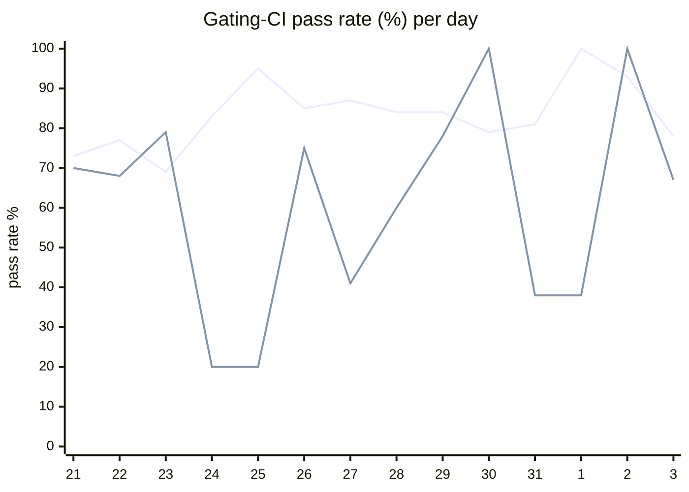

# CI Health Dashboard

_Window: last 14 days (trend + pass rate) · tables: last 24h · updated 2026-08-04T07:07:22Z · auto-generated, do not edit by hand._

**Gating-CI pass rate** — PR: 80% (1826/2288) · main: 66% (89/135)

## Gating-CI pass-rate trend

```mermaid
xychart-beta
  title "Gating-CI pass rate (%) per day"
  x-axis [21, 22, 23, 24, 25, 26, 27, 28, 29, 30, 31, 1, 2, 3]
  y-axis "pass rate %" 0 --> 100
  line "CI" [73, 77, 69, 83, 95, 85, 87, 84, 84, 79, 81, 100, 93, 78]
  line "main" [70, 68, 79, 20, 20, 75, 41, 60, 78, 100, 38, 38, 100, 67]
```

_X-axis = day of month (Jul 21 → Aug 03). Two lines: **CI** (PR gating-CI runs, generally the upper line) and **main** (post-merge main runs, lower). Y-axis = % of that day's gating-CI runs that passed._

## Top 10 failing jobs (last 24h)

| # | job | workflow | fails | recovered | runs | fail rate | flaky? | scope | cause |
| --- | --- | --- | --- | --- | --- | --- | --- | --- | --- |
| 1 | `generate` | test | 7 | 0 | 35 | 20% | flaky | PR | **infra/CI** — Prettier/codegen drift in generate job check-for-diff |
| 2 | `loadtest-arm` | build | 5 | 0 | 28 | 18% | flaky | PR | **product bug** — loadtest Docker build: missing cmd/hatchet-loadtest/eventkeys go module |
| 3 | `loadtest` | build | 5 | 0 | 28 | 18% | flaky | PR | **product bug** — loadtest Docker build: missing cmd/hatchet-loadtest/eventkeys go module |
| 4 | `unit` | test | 4 | 1 | 35 | 11% | flaky | main + PR | **flaky test** — TestInterval_RunInterval_WithJitter timing jitter race |
| 5 | `lint` | ruby | 4 | 0 | 9 | 44% | flaky | PR | **infra/CI** — Stale generated Ruby SDK bindings (check-for-diff) |
| 6 | `build` | frontend / docs | 3 | 0 | 12 | 25% | flaky | PR | **product bug** — Docs Next.js build: missing Callout component on self-hosting/networking page |
| 7 | `load` | test | 3 | 0 | 35 | 9% | flaky | PR | **timeout** — TestLoadCLI parent failed after subtest timeouts |
| 8 | `e2e-pgmq` | test | 3 | 0 | 35 | 9% | flaky | main + PR | **flaky test** — TestMultipleEvictionCycle non-deterministic eviction timing |
| 9 | `lint` | typescript | 2 | 0 | 10 | 20% | flaky | PR | **infra/CI** — Stale generated TypeScript SDK bindings (check-for-diff) |
| 10 | `lint` | python | 2 | 0 | 11 | 18% | flaky | PR | **infra/CI** — Stale generated Python SDK bindings (check-for-diff) |

## Top 10 failing tests (last 24h)

| # | test | job | fails | runs | fail rate | flaky? | scope | cause |
| --- | --- | --- | --- | --- | --- | --- | --- | --- |
| 1 | `(unparsed)` | `generate` | 7 | 35 | 20% | flaky | PR | **infra/CI** — Prettier/codegen drift in generate job check-for-diff |
| 2 | `TestLoadCLI` | `load` | 6 | 35 | 17% | flaky | PR | **timeout** — TestLoadCLI parent failed after subtest timeouts |
| 3 | `TestLoadCLI/test_with_global_concurrency_key` | `load` | 6 | 35 | 17% | flaky | PR | **timeout** — TestLoadCLI/test_with_global_concurrency_key hit 400s timeout |
| 4 | `TestLoadCLI/test_with_DAG` | `load` | 6 | 35 | 17% | flaky | PR | **timeout** — TestLoadCLI/test_with_DAG hit 400s job timeout |
| 5 | `TestLoadCLI/test_with_rate_limits` | `load` | 6 | 35 | 17% | flaky | PR | **timeout** — TestLoadCLI/test_with_rate_limits hit 400s job timeout |
| 6 | `TestLoadCLI/test_with_event_fanout` | `load` | 6 | 35 | 17% | flaky | PR | **timeout** — TestLoadCLI/test_with_event_fanout hit 400s timeout |
| 7 | `TestLoadCLI/test_simple_workflow` | `load` | 6 | 35 | 17% | flaky | PR | **timeout** — TestLoadCLI/test_simple_workflow hit 400s job timeout |
| 8 | `TestLoadCLI/test_for_many_queued_events_and_little_worker_throughput` | `load` | 6 | 35 | 17% | flaky | PR | **timeout** — TestLoadCLI throughput test hit 580s timeout |
| 9 | `(unparsed)` | `loadtest-arm` | 5 | 28 | 18% | flaky | PR | **product bug** — loadtest Docker build: missing cmd/hatchet-loadtest/eventkeys go module |
| 10 | `(unparsed)` | `loadtest` | 5 | 28 | 18% | flaky | PR | **product bug** — loadtest Docker build: missing cmd/hatchet-loadtest/eventkeys go module |

## Recent CI-health wins (`ci-health`)

**Recently merged**

- https://github.com/hatchet-dev/hatchet/pull/4239
- https://github.com/hatchet-dev/hatchet/pull/4238
- https://github.com/hatchet-dev/hatchet/pull/4218
- https://github.com/hatchet-dev/hatchet/pull/4213
- https://github.com/hatchet-dev/hatchet/pull/4165

**Open**

_No open `ci-health` PRs yet._

---
_Trend and pass-rate totals cover the last 14 days; job/test tables cover the last 24h._ **fails** = gating runs where the job/test failed · **recovered** = failed on a first attempt but passed on re-run (a flakiness signal) · **runs** = total gating runs of that workflow · **fail rate** = fails ÷ runs · **flaky** = recovered on re-run or intermittent across runs; **deterministic** = fails every time it runs · **scope** = whether failures were seen on PR, main, or main + PR.
