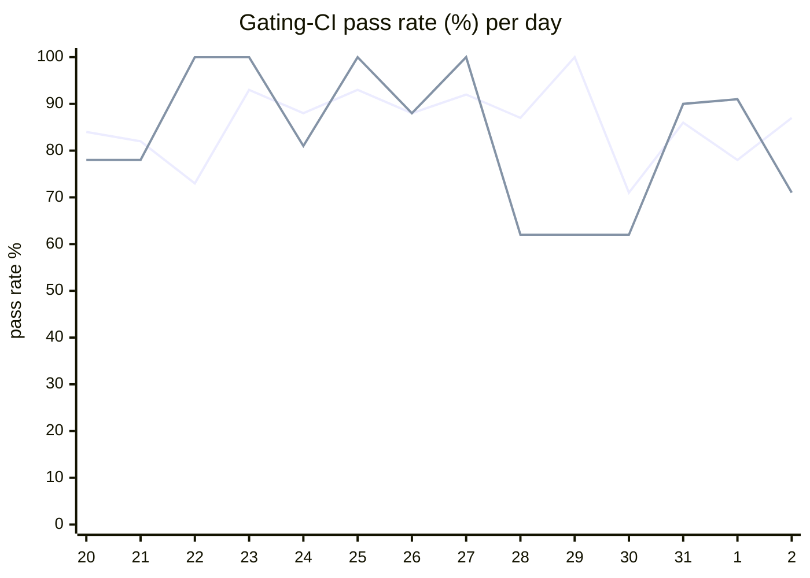

# CI Health Dashboard

_Window: last 14 days (trend + pass rate) · tables: last 24h · updated 2026-09-03T07:10:18Z · auto-generated, do not edit by hand._

**Gating-CI pass rate** — PR: 86% (2277/2662) · main: 84% (120/143)

## Gating-CI pass-rate trend

```mermaid
xychart-beta
  title "Gating-CI pass rate (%) per day"
  x-axis [20, 21, 22, 23, 24, 25, 26, 27, 28, 29, 30, 31, 1, 2]
  y-axis "pass rate %" 0 --> 100
  line "CI" [84, 82, 73, 93, 88, 93, 88, 92, 87, 100, 71, 86, 78, 87]
  line "main" [78, 78, 100, 100, 81, 100, 88, 100, 62, 62, 62, 90, 91, 71]
```

_X-axis = day of month (Aug 20 → Sep 02). Two lines: **CI** (PR gating-CI runs, generally the upper line) and **main** (post-merge main runs, lower). Y-axis = % of that day's gating-CI runs that passed._

## Top 10 failing jobs (last 24h)

| # | job | workflow | fails | recovered | runs | fail rate | flaky? | scope | cause |
| --- | --- | --- | --- | --- | --- | --- | --- | --- | --- |
| 1 | `generate` | test | 14 | 2 | 60 | 23% | flaky | main + PR | **infra/CI** — test/generate fails on pre-commit git fetch error during generate-all |
| 2 | `lint` | ruby | 12 | 1 | 47 | 26% | flaky | PR | **infra/CI** — Ruby generated protobuf/REST bindings drift; run sdks/ruby/generate.sh |
| 3 | `test` | ruby | 7 | 1 | 47 | 15% | flaky | PR | **flaky test** — Ruby NonRetryableWorkflow e2e flaky event count (expected 3, got 2) |
| 4 | `unit` | test | 5 | 2 | 60 | 8% | flaky | PR | **flaky test** — TestMsgIdBufferMemoryLeak intermittently times out sending messages to mq buffer |
| 5 | `test-templates` | cli-e2e-tests | 5 | 0 | 11 | 46% | flaky | main + PR | **flaky test** — CLI TestQuickstartTemplates fails when simple_go_go worker does not become ready |
| 6 | `integration` | test | 3 | 2 | 60 | 5% | flaky | main + PR | **flaky test** — TestCreateTenantToken hits duplicate Tenant_pkey from test isolation |
| 7 | `build` | frontend / docs | 2 | 0 | 27 | 7% | flaky | PR | **infra/CI** — frontend/docs build fails on invalid MDX frontmatter (migration-guide-python-v2.mdx) |
| 8 | `api` | build | 1 | 1 | 53 | 2% | flaky | PR | **infra/CI** — Docker build fails on go module proxy INTERNAL_ERROR fetching dependencies |
| 9 | `publish` | typescript | 1 | 0 | 49 | 2% | flaky | main | **infra/CI** — typescript publish tries to republish existing npm version 1.30.0 |
| 10 | `api-arm` | build | 1 | 0 | 53 | 2% | flaky | PR | **infra/CI** — Docker build fails on go module proxy INTERNAL_ERROR fetching dependencies |

## Top 10 failing tests (last 24h)

| # | test | job | fails | runs | fail rate | flaky? | scope | cause |
| --- | --- | --- | --- | --- | --- | --- | --- | --- |
| 1 | `(unparsed)` | `generate` | 14 | 60 | 23% | flaky | main + PR | **infra/CI** — test/generate fails on pre-commit git fetch error during generate-all |
| 2 | `(unparsed)` | `lint` | 11 | 47 | 23% | flaky | PR | **infra/CI** — Ruby generated protobuf/REST bindings drift; run sdks/ruby/generate.sh |
| 3 | `TestQuickstartTemplates` | `test-templates` | 4 | 11 | 36% | flaky | main + PR | **flaky test** — CLI TestQuickstartTemplates fails when simple_go_go worker does not become ready |
| 4 | `TestQuickstartTemplates/simple_go_go` | `test-templates` | 4 | 11 | 36% | flaky | main + PR | **flaky test** — CLI TestQuickstartTemplates/simple_go_go worker startup times out |
| 5 | `./non_retryable/test_no_retry_spec.rb:7` | `test` | 4 | 47 | 8% | flaky | PR | **flaky test** — Ruby NonRetryableWorkflow e2e flaky event count (expected 3, got 2) |
| 6 | `(unparsed)` | `lint` | 4 | 48 | 8% | flaky | PR | **infra/CI** — Python generated protobuf/REST bindings drift; run sdks/python/generate.sh |
| 7 | `TestMsgIdBufferMemoryLeak` | `unit` | 4 | 60 | 7% | flaky | PR | **flaky test** — TestMsgIdBufferMemoryLeak intermittently times out sending messages to mq buffer |
| 8 | `(unparsed)` | `build` | 2 | 27 | 7% | flaky | PR | **infra/CI** — frontend/docs build fails on invalid MDX frontmatter (migration-guide-python-v2.mdx) |
| 9 | `./cancellation/test_cancellation_spec.rb:7` | `test` | 2 | 47 | 4% | flaky | PR | **flaky test** — Ruby CancelWorkflow e2e times out polling run status (60s) |
| 10 | `TestCreateTenantToken` | `integration` | 2 | 60 | 3% | flaky | main + PR | **flaky test** — TestCreateTenantToken hits duplicate Tenant_pkey from test isolation |

## Recent CI-health wins (`ci-health`)

**Recently merged**

- https://github.com/hatchet-dev/hatchet/pull/4239
- https://github.com/hatchet-dev/hatchet/pull/4238
- https://github.com/hatchet-dev/hatchet/pull/4218
- https://github.com/hatchet-dev/hatchet/pull/4213
- https://github.com/hatchet-dev/hatchet/pull/4165

**Open**

_No open `ci-health` PRs yet._

---
_Trend and pass-rate totals cover the last 14 days; job/test tables cover the last 24h._ **fails** = gating runs where the job/test failed · **recovered** = failed on a first attempt but passed on re-run (a flakiness signal) · **runs** = total gating runs of that workflow · **fail rate** = fails ÷ runs · **flaky** = recovered on re-run or intermittent across runs; **deterministic** = fails every time it runs · **scope** = whether failures were seen on PR, main, or main + PR.
