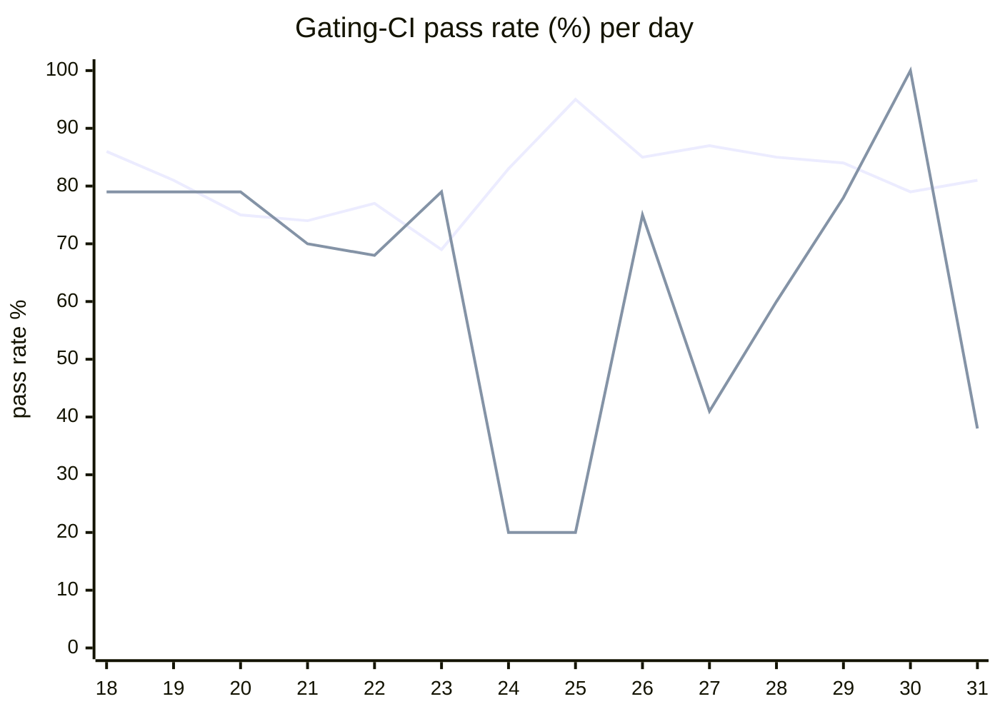

# CI Health Dashboard

_Window: last 14 days (trend + pass rate) · tables: last 24h · updated 2026-08-01T07:06:58Z · auto-generated, do not edit by hand._

**Gating-CI pass rate** — PR: 79% (1908/2412) · main: 68% (97/143)

## Gating-CI pass-rate trend

```mermaid
xychart-beta
  title "Gating-CI pass rate (%) per day"
  x-axis [18, 19, 20, 21, 22, 23, 24, 25, 26, 27, 28, 29, 30, 31]
  y-axis "pass rate %" 0 --> 100
  line "CI" [86, 81, 75, 74, 77, 69, 83, 95, 85, 87, 85, 84, 79, 81]
  line "main" [79, 79, 79, 70, 68, 79, 20, 20, 75, 41, 60, 78, 100, 38]
```

_X-axis = day of month (Jul 18 → Jul 31). Two lines: **CI** (PR gating-CI runs, generally the upper line) and **main** (post-merge main runs, lower). Y-axis = % of that day's gating-CI runs that passed._

## Top 10 failing jobs (last 24h)

| # | job | workflow | fails | recovered | runs | fail rate | flaky? | scope | cause |
| --- | --- | --- | --- | --- | --- | --- | --- | --- | --- |
| 1 | `e2e` | test | 6 | 0 | 33 | 18% | flaky | main + PR | **flaky test** — TestMultipleEvictionCycle intermittently fails in e2e eviction timing |
| 2 | `integration` | test | 6 | 0 | 33 | 18% | flaky | PR | **flaky test** — TestConcurrency_GroupRoundRobin race in integration concurrency tests |
| 3 | `generate` | test | 6 | 0 | 33 | 18% | flaky | PR | **infra/CI** — Prettier/codegen check-for-diff drift in generate job |
| 4 | `compile` | go | 4 | 0 | 30 | 13% | flaky | PR | **infra/CI** — go.sum missing github.com/doyensec/safeurl entry after safeclient import |
| 5 | `e2e-pgmq` | test | 4 | 0 | 33 | 12% | flaky | main + PR | **flaky test** — TestFlush_ConcurrentCountsKeepMarkerInvariants race in e2e-pgmq |
| 6 | `unit` | test | 4 | 0 | 33 | 12% | flaky | PR | **flaky test** — TestMsgIdBufferMemoryLeak non-deterministic in unit tests |
| 7 | `lint` | ruby | 3 | 0 | 25 | 12% | flaky | PR | **infra/CI** — Ruby generated bindings out of date vs source |
| 8 | `rampup` | test | 3 | 0 | 33 | 9% | flaky | main + PR | **flaky test** — TestListenReconnectingStreamHandlesEventsAndStopsOnEOF timing-sensitive reconnect |
| 9 | `load` | test | 3 | 0 | 33 | 9% | flaky | main + PR | **timeout** — TestLoadCLI/test_with_DAG exceeded 400s subtest budget |
| 10 | `build` | frontend / app | 2 | 0 | 17 | 12% | flaky | PR | **product bug** — Workflow page tab type mismatch: shape not in allowed union |

## Top 10 failing tests (last 24h)

| # | test | job | fails | runs | fail rate | flaky? | scope | cause |
| --- | --- | --- | --- | --- | --- | --- | --- | --- |
| 1 | `(unparsed)` | `compile` | 4 | 30 | 13% | flaky | PR | **infra/CI** — go.sum missing github.com/doyensec/safeurl entry after safeclient import |
| 2 | `TestMultipleEvictionCycle` | `e2e` | 4 | 33 | 12% | flaky | main + PR | **flaky test** — TestMultipleEvictionCycle intermittently fails in e2e eviction timing |
| 3 | `(unparsed)` | `generate` | 4 | 33 | 12% | flaky | PR | **infra/CI** — Prettier/codegen check-for-diff drift in generate job |
| 4 | `TestConcurrency_GroupRoundRobin` | `integration` | 4 | 33 | 12% | flaky | PR | **flaky test** — TestConcurrency_GroupRoundRobin race in integration concurrency tests |
| 5 | `(unparsed)` | `lint` | 3 | 25 | 12% | flaky | PR | **infra/CI** — Ruby generated bindings out of date vs source |
| 6 | `examples/conditions/test_conditions.py::test_cancel_if_user_event` | `test` | 3 | 30 | 10% | flaky | PR | **product bug** — cancel_if_user_event: run COMPLETED instead of CANCELLED |
| 7 | `(unparsed)` | `lite-amd` | 2 | 25 | 8% | flaky | PR | **infra/CI** — Docker dashboard build fails on frontend TypeScript compile errors |
| 8 | `(unparsed)` | `dashboard-amd` | 2 | 25 | 8% | flaky | PR | **infra/CI** — Docker dashboard build fails on frontend TypeScript compile errors |
| 9 | `(unparsed)` | `authdisabled` | 2 | 25 | 8% | flaky | PR | **infra/CI** — Docker dashboard build fails on frontend TypeScript compile errors |
| 10 | `(unparsed)` | `dashboard-arm` | 2 | 25 | 8% | flaky | PR | **infra/CI** — Docker dashboard build fails on frontend TypeScript compile errors |

## Recent CI-health wins (`ci-health`)

**Recently merged**

- https://github.com/hatchet-dev/hatchet/pull/4239
- https://github.com/hatchet-dev/hatchet/pull/4238
- https://github.com/hatchet-dev/hatchet/pull/4218
- https://github.com/hatchet-dev/hatchet/pull/4213
- https://github.com/hatchet-dev/hatchet/pull/4165

**Open**

_No open `ci-health` PRs yet._

---
_Trend and pass-rate totals cover the last 14 days; job/test tables cover the last 24h._ **fails** = gating runs where the job/test failed · **recovered** = failed on a first attempt but passed on re-run (a flakiness signal) · **runs** = total gating runs of that workflow · **fail rate** = fails ÷ runs · **flaky** = recovered on re-run or intermittent across runs; **deterministic** = fails every time it runs · **scope** = whether failures were seen on PR, main, or main + PR.
