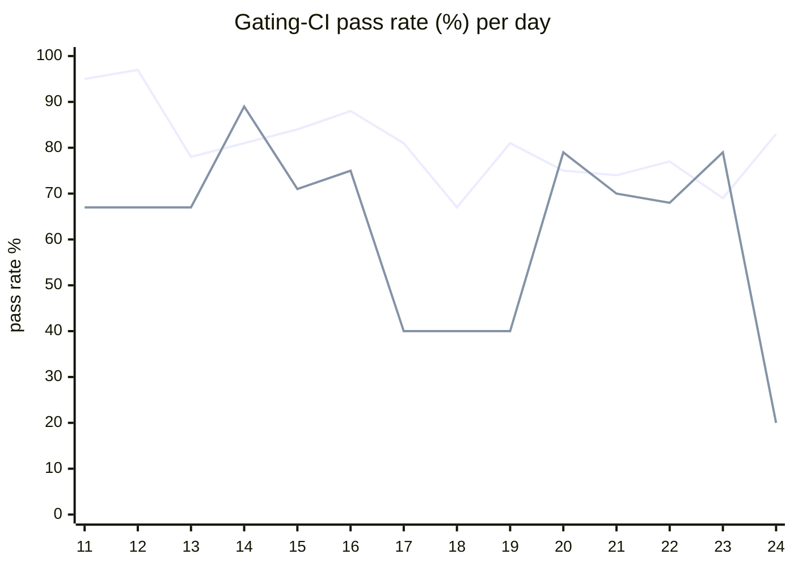

# CI Health Dashboard

_Window: last 14 days (trend + pass rate) · tables: last 24h · updated 2026-07-25T07:05:21Z · auto-generated, do not edit by hand._

**Gating-CI pass rate** — PR: 79% (1983/2523) · main: 72% (107/148)

## Gating-CI pass-rate trend

```mermaid
xychart-beta
  title "Gating-CI pass rate (%) per day"
  x-axis [11, 12, 13, 14, 15, 16, 17, 18, 19, 20, 21, 22, 23, 24]
  y-axis "pass rate %" 0 --> 100
  line "CI" [95, 97, 78, 81, 84, 88, 81, 67, 81, 75, 74, 77, 69, 83]
  line "main" [67, 67, 67, 89, 71, 75, 40, 40, 40, 79, 70, 68, 79, 20]
```

_X-axis = day of month (Jul 11 → Jul 24). Two lines: **CI** (PR gating-CI runs, generally the upper line) and **main** (post-merge main runs, lower). Y-axis = % of that day's gating-CI runs that passed._

## Top 10 failing jobs (last 24h)

| # | job | workflow | fails | recovered | runs | fail rate | flaky? | scope | cause |
| --- | --- | --- | --- | --- | --- | --- | --- | --- | --- |
| 1 | `unit` | test | 4 | 0 | 14 | 29% | flaky | main + PR | **flaky test** — TestRandomTicker: tick duration exceeded threshold on loaded runner |
| 2 | `dashboard-amd` | build | 2 | 1 | 12 | 17% | flaky | PR | **product bug** — Docker dashboard-amd build: frontend npm run build TS7006 in code-editor.tsx (Alpine log line is noise) |
| 3 | `test` | python | 2 | 0 | 8 | 25% | flaky | PR | **flaky test** — test_waits: random_number vs skipped assertion race in conditions example |
| 4 | `lite-arm` | build | 2 | 0 | 12 | 17% | flaky | PR | **infra/CI** — Docker lite-arm build: npm registry HTTP 522 fetching pnpm via corepack (Alpine log line is noise) |
| 5 | `generate` | test | 2 | 0 | 14 | 14% | flaky | PR | **infra/CI** — Install Task step: HTTP 504 downloading go-task release |
| 6 | `e2e` | test | 2 | 0 | 14 | 14% | flaky | PR | **flaky test** — TestMultipleEvictionCycle eviction timing race in e2e |
| 7 | `e2e-pgmq` | test | 2 | 0 | 14 | 14% | flaky | main | **infra/CI** — Go deps: proxy.golang.org stream error fetching docker module |
| 8 | `build` | frontend / app | 1 | 0 | 8 | 12% | flaky | PR | **product bug** — frontend/app build: code-editor.tsx parameter implicitly has any type (TS7006) |
| 9 | `lint` | frontend / app | 1 | 0 | 8 | 12% | flaky | PR | **infra/CI** — frontend/app lint prettier/prettier formatting drift |
| 10 | `frontend` | build | 1 | 0 | 12 | 8% | flaky | PR | **unknown** — Noisy sample from passing span subtest; same job fails on frontend TS compile in Docker build |

## Top 10 failing tests (last 24h)

| # | test | job | fails | runs | fail rate | flaky? | scope | cause |
| --- | --- | --- | --- | --- | --- | --- | --- | --- |
| 1 | `examples/conditions/test_conditions.py::test_waits` | `test` | 3 | 8 | 38% | flaky | PR | **flaky test** — test_waits: random_number vs skipped assertion race in conditions example |
| 2 | `(unparsed)` | `dashboard-amd` | 3 | 12 | 25% | flaky | PR | **product bug** — Docker dashboard-amd build: frontend npm run build TS7006 in code-editor.tsx (Alpine log line is noise) |
| 3 | `TestRandomTicker` | `unit` | 3 | 14 | 21% | flaky | main + PR | **flaky test** — TestRandomTicker: tick duration exceeded threshold on loaded runner |
| 4 | `(unparsed)` | `lite-arm` | 2 | 12 | 17% | flaky | PR | **infra/CI** — Docker lite-arm build: npm registry HTTP 522 fetching pnpm via corepack (Alpine log line is noise) |
| 5 | `TestMultipleEvictionCycle` | `e2e` | 2 | 14 | 14% | flaky | PR | **flaky test** — TestMultipleEvictionCycle eviction timing race in e2e |
| 6 | `(unparsed)` | `build` | 1 | 8 | 12% | flaky | PR | **product bug** — frontend/app build: code-editor.tsx parameter implicitly has any type (TS7006) |
| 7 | `(unparsed)` | `lint` | 1 | 8 | 12% | flaky | PR | **infra/CI** — frontend/app lint prettier/prettier formatting drift |
| 8 | `(unparsed)` | `test` | 1 | 8 | 12% | flaky | PR | **infra/CI** — Install Protoc step: HTTP 504 downloading protoc release |
| 9 | `(unparsed)` | `frontend` | 1 | 12 | 8% | flaky | PR | **unknown** — Noisy sample from passing span subtest; same job fails on frontend TS compile in Docker build |
| 10 | `(unparsed)` | `dashboard-arm` | 1 | 12 | 8% | flaky | PR | **product bug** — Docker dashboard-arm build: frontend npm run build TS7006 in code-editor.tsx (Alpine log line is noise) |

## Recent CI-health wins (`ci-health`)

**Recently merged**

- https://github.com/hatchet-dev/hatchet/pull/4239
- https://github.com/hatchet-dev/hatchet/pull/4238
- https://github.com/hatchet-dev/hatchet/pull/4218
- https://github.com/hatchet-dev/hatchet/pull/4213
- https://github.com/hatchet-dev/hatchet/pull/4165

**Open**

_No open `ci-health` PRs yet._

---
_Trend and pass-rate totals cover the last 14 days; job/test tables cover the last 24h._ **fails** = gating runs where the job/test failed · **recovered** = failed on a first attempt but passed on re-run (a flakiness signal) · **runs** = total gating runs of that workflow · **fail rate** = fails ÷ runs · **flaky** = recovered on re-run or intermittent across runs; **deterministic** = fails every time it runs · **scope** = whether failures were seen on PR, main, or main + PR.
