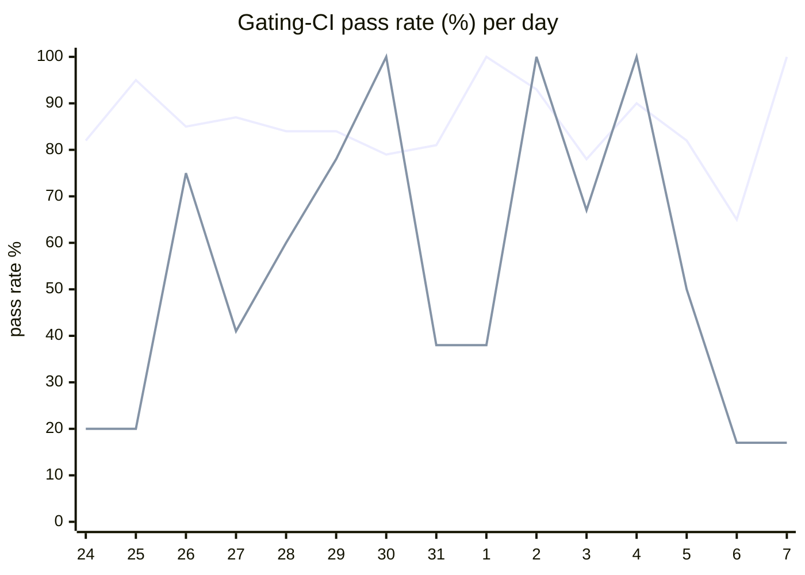

# CI Health Dashboard

_Window: last 14 days (trend + pass rate) · tables: last 24h · updated 2026-08-07T07:05:04Z · auto-generated, do not edit by hand._

**Gating-CI pass rate** — PR: 83% (1690/2044) · main: 60% (56/94)

## Gating-CI pass-rate trend

```mermaid
xychart-beta
  title "Gating-CI pass rate (%) per day"
  x-axis [24, 25, 26, 27, 28, 29, 30, 31, 1, 2, 3, 4, 5, 6, 7]
  y-axis "pass rate %" 0 --> 100
  line "CI" [82, 95, 85, 87, 84, 84, 79, 81, 100, 93, 78, 90, 82, 65, 100]
  line "main" [20, 20, 75, 41, 60, 78, 100, 38, 38, 100, 67, 100, 50, 17, 17]
```

_X-axis = day of month (Jul 24 → Aug 07). Two lines: **CI** (PR gating-CI runs, generally the upper line) and **main** (post-merge main runs, lower). Y-axis = % of that day's gating-CI runs that passed._

## Top 10 failing jobs (last 24h)

| # | job | workflow | fails | recovered | runs | fail rate | flaky? | scope | cause |
| --- | --- | --- | --- | --- | --- | --- | --- | --- | --- |
| 1 | `api-arm` | build | 4 | 0 | 20 | 20% | flaky | PR | **infra/CI** — GitHub Actions action download service unavailable during job setup |
| 2 | `engine-arm` | build | 4 | 0 | 20 | 20% | flaky | PR | **infra/CI** — GitHub Actions action download service unavailable during job setup |
| 3 | `dashboard-arm` | build | 3 | 1 | 20 | 15% | flaky | PR | **infra/CI** — GitHub Actions action download service unavailable during job setup |
| 4 | `compile` | go | 3 | 0 | 15 | 20% | flaky | PR | **infra/CI** — GitHub Actions action download service unavailable during job setup |
| 5 | `generate` | test | 3 | 0 | 20 | 15% | flaky | main + PR | **infra/CI** — generate job Check for diff step failed (codegen/format drift) |
| 6 | `rampup` | test | 3 | 0 | 20 | 15% | flaky | main + PR | **infra/CI** — GitHub Actions action download service unavailable during job setup |
| 7 | `frontend` | build | 3 | 0 | 20 | 15% | flaky | PR | **infra/CI** — GitHub Actions action download service unavailable during job setup |
| 8 | `admin` | build | 3 | 0 | 20 | 15% | flaky | PR | **infra/CI** — GitHub Actions action download service unavailable during job setup |
| 9 | `loadtest` | build | 3 | 0 | 20 | 15% | flaky | PR | **infra/CI** — GitHub Actions action download service unavailable during job setup |
| 10 | `migrate-arm` | build | 3 | 0 | 20 | 15% | flaky | PR | **infra/CI** — GitHub Actions action download service unavailable during job setup |

## Top 10 failing tests (last 24h)

| # | test | job | fails | runs | fail rate | flaky? | scope | cause |
| --- | --- | --- | --- | --- | --- | --- | --- | --- |
| 1 | `(unparsed)` | `lint` | 5 | 16 | 31% | flaky | main + PR | **infra/CI** — GitHub Actions action download service unavailable during job setup |
| 2 | `(unparsed)` | `test` | 4 | 16 | 25% | flaky | main + PR | **infra/CI** — GitHub Actions action download service unavailable during job setup |
| 3 | `(unparsed)` | `load` | 4 | 20 | 20% | flaky | main + PR | **infra/CI** — GitHub Actions action download service unavailable during job setup |
| 4 | `(unparsed)` | `test` | 3 | 15 | 20% | flaky | PR | **infra/CI** — GitHub Actions action download service unavailable during job setup |
| 5 | `(unparsed)` | `test-e2e` | 3 | 15 | 20% | flaky | PR | **infra/CI** — GitHub Actions action download service unavailable during job setup |
| 6 | `(unparsed)` | `compile` | 3 | 15 | 20% | flaky | PR | **infra/CI** — GitHub Actions action download service unavailable during job setup |
| 7 | `(unparsed)` | `frontend` | 3 | 20 | 15% | flaky | PR | **infra/CI** — GitHub Actions action download service unavailable during job setup |
| 8 | `(unparsed)` | `api-arm` | 3 | 20 | 15% | flaky | PR | **infra/CI** — GitHub Actions action download service unavailable during job setup |
| 9 | `(unparsed)` | `dashboard-amd` | 3 | 20 | 15% | flaky | PR | **infra/CI** — GitHub Actions action download service unavailable during job setup |
| 10 | `(unparsed)` | `migrate-arm` | 3 | 20 | 15% | flaky | PR | **infra/CI** — GitHub Actions action download service unavailable during job setup |

## Recent CI-health wins (`ci-health`)

**Recently merged**

- https://github.com/hatchet-dev/hatchet/pull/4239
- https://github.com/hatchet-dev/hatchet/pull/4238
- https://github.com/hatchet-dev/hatchet/pull/4218
- https://github.com/hatchet-dev/hatchet/pull/4213
- https://github.com/hatchet-dev/hatchet/pull/4165

**Open**

_No open `ci-health` PRs yet._

---
_Trend and pass-rate totals cover the last 14 days; job/test tables cover the last 24h._ **fails** = gating runs where the job/test failed · **recovered** = failed on a first attempt but passed on re-run (a flakiness signal) · **runs** = total gating runs of that workflow · **fail rate** = fails ÷ runs · **flaky** = recovered on re-run or intermittent across runs; **deterministic** = fails every time it runs · **scope** = whether failures were seen on PR, main, or main + PR.
