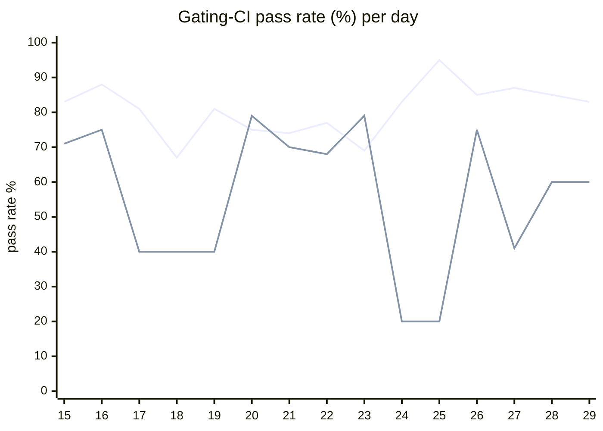

# CI Health Dashboard

_Window: last 14 days (trend + pass rate) · tables: last 24h · updated 2026-07-29T07:07:21Z · auto-generated, do not edit by hand._

**Gating-CI pass rate** — PR: 79% (1876/2364) · main: 67% (98/147)

## Gating-CI pass-rate trend

```mermaid
xychart-beta
  title "Gating-CI pass rate (%) per day"
  x-axis [15, 16, 17, 18, 19, 20, 21, 22, 23, 24, 25, 26, 27, 28, 29]
  y-axis "pass rate %" 0 --> 100
  line "CI" [83, 88, 81, 67, 81, 75, 74, 77, 69, 83, 95, 85, 87, 85, 83]
  line "main" [71, 75, 40, 40, 40, 79, 70, 68, 79, 20, 20, 75, 41, 60, 60]
```

_X-axis = day of month (Jul 15 → Jul 29). Two lines: **CI** (PR gating-CI runs, generally the upper line) and **main** (post-merge main runs, lower). Y-axis = % of that day's gating-CI runs that passed._

## Top 10 failing jobs (last 24h)

| # | job | workflow | fails | recovered | runs | fail rate | flaky? | scope | cause |
| --- | --- | --- | --- | --- | --- | --- | --- | --- | --- |
| 1 | `generate` | test | 6 | 0 | 40 | 15% | flaky | PR | **infra/CI** — generate job Check for diff fails on uncommitted prettier/codegen output |
| 2 | `integration` | test | 4 | 2 | 40 | 10% | flaky | PR | **flaky test** — TestConcurrency_GroupRoundRobin round-robin assignment timing race |
| 3 | `compile` | go | 5 | 0 | 30 | 17% | flaky | PR | **infra/CI** — missing go.sum entry for safeurl blocks Go SDK example compile |
| 4 | `e2e-pgmq` | test | 5 | 0 | 40 | 12% | flaky | main + PR | **flaky test** — TestMultipleEvictionCycle eviction timing race in e2e-pgmq job |
| 5 | `unit` | test | 4 | 1 | 40 | 10% | flaky | main + PR | **flaky test** — TestScheduler_TryAssign_NotStarvedByRepeatedReplenishTimeouts replenish timeout race |
| 6 | `test` | python | 4 | 0 | 32 | 12% | flaky | PR | **flaky test** — test_waits conditions example races on random_number vs skipped |
| 7 | `rampup` | test | 4 | 0 | 40 | 10% | flaky | PR | **flaky test** — TestMsgIdBufferMemoryLeak msgIdBufferCh send timeout under concurrent load |
| 8 | `test` | ruby | 2 | 0 | 30 | 7% | flaky | PR | **flaky test** — Ruby non_retryable e2e misses retrying event (expected 1, got 0) |
| 9 | `e2e` | test | 2 | 0 | 40 | 5% | flaky | PR | **flaky test** — TestMultipleEvictionCycle eviction timing race in e2e job |
| 10 | `lint` | frontend / docs | 1 | 0 | 15 | 7% | flaky | PR | **infra/CI** — frontend/docs prettier check lists platform.mdx as unformatted |

## Top 10 failing tests (last 24h)

| # | test | job | fails | runs | fail rate | flaky? | scope | cause |
| --- | --- | --- | --- | --- | --- | --- | --- | --- |
| 1 | `examples/conditions/test_conditions.py::test_waits` | `test` | 10 | 32 | 31% | flaky | PR | **flaky test** — test_waits conditions example races on random_number vs skipped |
| 2 | `(unparsed)` | `generate` | 5 | 40 | 12% | flaky | PR | **infra/CI** — generate job Check for diff fails on uncommitted prettier/codegen output |
| 3 | `(unparsed)` | `compile` | 4 | 30 | 13% | flaky | PR | **infra/CI** — missing go.sum entry for safeurl blocks Go SDK example compile |
| 4 | `TestMultipleEvictionCycle` | `e2e-pgmq` | 4 | 40 | 10% | flaky | main + PR | **flaky test** — TestMultipleEvictionCycle eviction timing race in e2e-pgmq job |
| 5 | `TestMsgIdBufferMemoryLeak` | `rampup` | 3 | 40 | 8% | flaky | PR | **flaky test** — TestMsgIdBufferMemoryLeak msgIdBufferCh send timeout under concurrent load |
| 6 | `TestConcurrency_GroupRoundRobin` | `integration` | 3 | 40 | 8% | flaky | PR | **flaky test** — TestConcurrency_GroupRoundRobin round-robin assignment timing race |
| 7 | `./non_retryable/test_no_retry_spec.rb:7` | `test` | 2 | 30 | 7% | flaky | PR | **flaky test** — Ruby non_retryable e2e misses retrying event (expected 1, got 0) |
| 8 | `examples/conditions/test_conditions.py::test_cancel_if_user_event` | `test` | 2 | 32 | 6% | flaky | PR | **flaky test** — test_cancel_if_user_event races COMPLETED vs CANCELLED status |
| 9 | `(unparsed)` | `lint` | 2 | 32 | 6% | flaky | PR | **infra/CI** — poetry.lock out of sync with pyproject.toml during lint tool install |
| 10 | `(unparsed)` | `test` | 2 | 32 | 6% | flaky | PR | **infra/CI** — poetry.lock out of sync with pyproject.toml during dependency install |

## Recent CI-health wins (`ci-health`)

**Recently merged**

- https://github.com/hatchet-dev/hatchet/pull/4239
- https://github.com/hatchet-dev/hatchet/pull/4238
- https://github.com/hatchet-dev/hatchet/pull/4218
- https://github.com/hatchet-dev/hatchet/pull/4213
- https://github.com/hatchet-dev/hatchet/pull/4165

**Open**

_No open `ci-health` PRs yet._

---
_Trend and pass-rate totals cover the last 14 days; job/test tables cover the last 24h._ **fails** = gating runs where the job/test failed · **recovered** = failed on a first attempt but passed on re-run (a flakiness signal) · **runs** = total gating runs of that workflow · **fail rate** = fails ÷ runs · **flaky** = recovered on re-run or intermittent across runs; **deterministic** = fails every time it runs · **scope** = whether failures were seen on PR, main, or main + PR.
